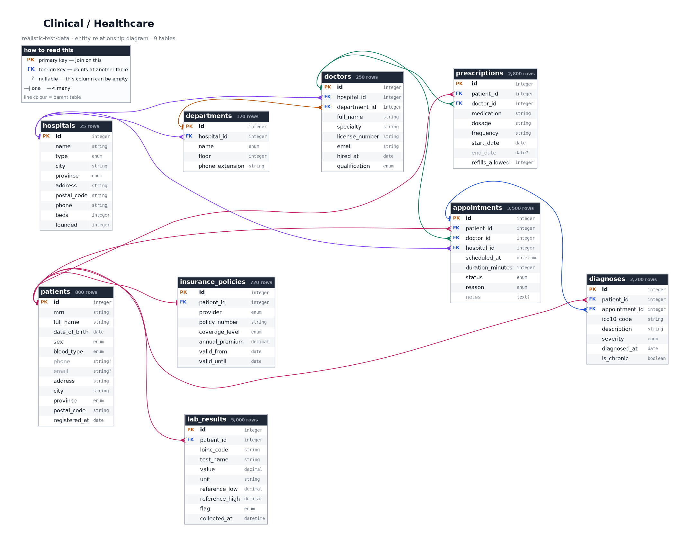

# Trace one record through the whole repository

> ⚠️ **SYNTHETIC DATA.** Dominga Nevado Manzano does not exist.
> See [synthetic-data-guarantees.md](synthetic-data-guarantees.md).

**This is the fastest way to understand this repository.** Follow one
patient from a CSV row to a SQLite join to a rendered diagram, and you will
have met every idea the repository is built on — foreign keys, cross-format
consistency, derived columns and real code systems — in about ten minutes.

Everything below is a real value you can look up yourself.

---

## 1. Meet the patient

Open [`csv/clinical/patients.csv`](../csv/clinical/patients.csv) and find
row 4:

```
id,mrn,full_name,date_of_birth,sex,blood_type,phone,email,address,city,province,postal_code,registered_at
4,MRN-0000004,Dominga Nevado Manzano,1959-12-25,F,O+,...,Barcelona,Barcelona,08011,2023-12-18
```

Things to notice immediately:

- **Two surnames.** `Nevado Manzano` — the father's then the mother's, as
  Spanish names are built. Any code that assumes one surname will get this
  wrong.
- **`08011` is Barcelona.** The first two digits of a Spanish postal code
  *are* the province code, and `08` is Barcelona. The `city` and `province`
  columns agree with it, always.
- **`MRN-0000004`** is the Medical Record Number — what a hospital actually
  identifies a patient by, because names are ambiguous and change. The `id`
  is for joining; the MRN is what gets printed on a wristband.

## 2. Her appointments

Filter [`appointments.csv`](../csv/clinical/appointments.csv) to
`patient_id = 4`. There are seven. The first:

```
id=1130   2024-10-02T08:15:00   completed   Acute symptoms   doctor_id=25   hospital_id=12
```

Follow `doctor_id = 25` into [`doctors.csv`](../csv/clinical/doctors.csv):

> **Dra. Carmelita Pujol** — Vascular Surgery, General Surgery department,
> Hospital Universitario Nuestra Señora del Robledo, Sevilla

Two things worth pausing on:

- **`Dra.`, not `Dr.`** The Spanish title is gendered, and it agrees with
  the name. The generator chooses both together.
- **A Barcelona patient at a Sevilla hospital.** That is not a bug — the
  column description for `patients.city` says explicitly it is "not
  necessarily the same city as the hospital the patient attends". People
  travel for specialist care. If it had been *always* the same city, that
  would have been the unrealistic version.

And `hospital_id = 12` is the same hospital the doctor works at — always.
That consistency is [asserted in CI](../tests/test_data_integrity.py), not
hoped for.

## 3. A diagnosis

In [`diagnoses.csv`](../csv/clinical/diagnoses.csv), `patient_id = 4` has
nine rows. One of them:

```
id=336   appointment_id=1600   J45.909   Unspecified asthma, uncomplicated   moderate   2025-01-10
```

**`J45.909` is a real ICD-10 code.** Look it up in any public ICD browser
and you will get the same description that sits in the next column. The
codes are genuine because they are a public classification of *diseases* —
nomenclature, not information about anybody. That is what makes this data
usable for testing a real terminology integration.

Note the diagnosis hangs off appointment 1600, and that appointment's status
is `completed`. A cancelled visit cannot diagnose anything, so no diagnosis
in this dataset points at one.

## 4. A lab result

[`lab_results.csv`](../csv/clinical/lab_results.csv), `patient_id = 4`,
two HbA1c measurements six months apart:

| collected_at | value | unit | ref low | ref high | flag |
|---|---|---|---|---|---|
| 2024-12-20 | 5.04 | % | 4.0 | 5.7 | `NORMAL` |
| 2025-06-18 | **5.72** | % | 4.0 | 5.7 | `HIGH` |

`5.72` is above `5.7`, so the flag is `HIGH`. By a hundredth of a percent —
exactly the kind of borderline case that breaks naive comparison code.

**`flag` is fully derivable** from `value`, `reference_low` and
`reference_high`. It is stored anyway, because real laboratory systems store
it. That makes it a ready-made exercise: recompute it yourself for all 5,000
rows and check you get the same answer. (You will — it is
[tested](../tests/test_data_integrity.py).)

Her values also sit where they should for a woman born in 1959. Lab results
are generated from **age-adjusted** distributions, which is why mean HbA1c
across the dataset runs about 4.9% in under-35s and 5.9% in over-70s.

## 5. The same patient in JSON

Open [`json/clinical/patients.json`](../json/clinical/patients.json) and
find index 3. Same record, same order, same values:

```json
{
  "id": 4,
  "mrn": "MRN-0000004",
  "full_name": "Dominga Nevado Manzano",
  "date_of_birth": "1959-12-25",
  "blood_type": "O+",
  "postal_code": "08011"
}
```

The difference is `null`. Where the CSV has an empty field, the JSON has a
real `null` — CSV genuinely cannot distinguish an empty string from a
missing value, and JSON can.

This is the repository's central promise: **the same records in every
format, in the same order.** Benchmark a CSV parser against a JSON parser
here and you are measuring the parser, not the data.

## 6. All of it at once, in SQL

```bash
sqlite3 db/clinical/clinical.sqlite
```

```sql
PRAGMA foreign_keys = ON;

SELECT p.mrn, p.full_name,
       a.scheduled_at, d.full_name AS doctor, h.name AS hospital,
       dx.icd10_code, dx.description
FROM patients p
JOIN appointments a ON a.patient_id = p.id
JOIN doctors      d ON d.id = a.doctor_id
JOIN hospitals    h ON h.id = a.hospital_id
LEFT JOIN diagnoses dx ON dx.appointment_id = a.id
WHERE p.mrn = 'MRN-0000004'
ORDER BY a.scheduled_at;
```

That is five tables joined, and every single join resolves — there are no
orphan rows anywhere in this repository.

Note the `LEFT JOIN` on diagnoses: not every appointment produces one.
Use an inner join there and you silently lose appointments.

## 7. Her insurance — and the patients who have none

```
provider=Lakeview Assurance   policy_number=POL-00000004   Premium   €5,090.68/year
```

She is insured. **Ten percent of patients are not**, deliberately:

```sql
SELECT COUNT(*) FROM patients p
LEFT JOIN insurance_policies i ON i.patient_id = p.id
WHERE i.id IS NULL;
-- 80
```

Those 80 rows exist so that code which assumes every patient has a policy
fails here, in your tests, rather than in production.

## 8. See the shape of it



Every table, every column, every relationship — with lines coloured by
parent table so you can trace `patients` through all six tables that
reference it. Generated from the same schema definitions as the data, so it
cannot go out of date.

Full size: [`png/clinical/erd.png`](../png/clinical/erd.png).

---

## What you now know

| | |
|---|---|
| Foreign keys resolve | Five tables joined, zero orphans |
| Formats agree | CSV ≡ JSON ≡ SQLite, same rows, same order |
| Derived columns are consistent | `flag` follows from `value` and the range |
| Real code systems are real | `J45.909` looks up in a public ICD browser |
| Deliberate gaps exist | 10% uninsured, for your `LEFT JOIN` to miss |
| Values correlate | Lab results shift with patient age |
| Spanish data is coherent | Postal code, province, city and phone prefix agree |

Every one of those is [enforced by a test](../tests/test_data_integrity.py)
rather than left to chance.

## Next

- [Column dictionary for this topic](topics/clinical.md) — every field explained
- [Choosing a file](02-choosing-a-file.md) — "I want to test X" → use this
- [Linking files into your project](linking-files.md) — CDN URLs and pinning
- [Glossary](glossary.md) — MRN, ICD-10, LOINC, IBAN, VIN…
