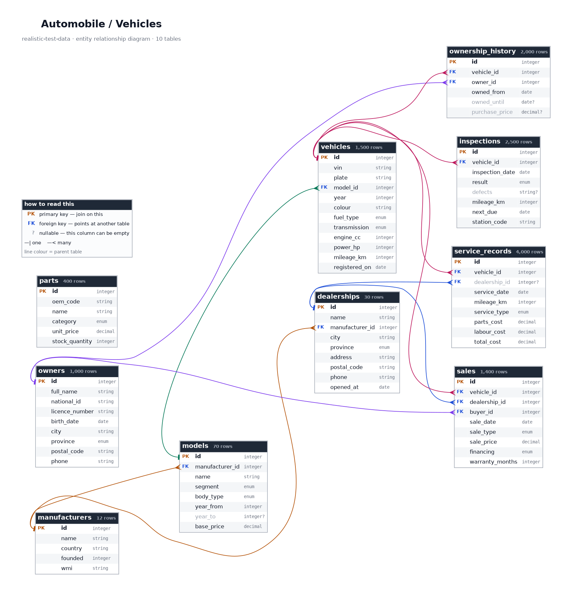
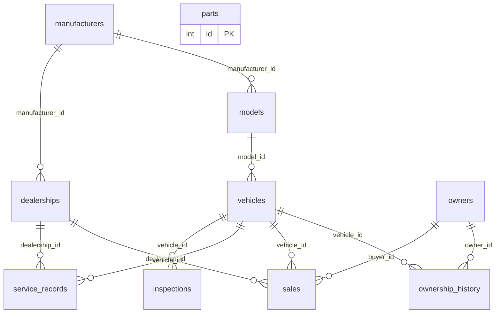

# Automobile / Vehicles

> ⚠️ **SYNTHETIC DATA.** Every record in this repository is invented. No real people, patients, accounts, vehicles or students appear here. See [synthetic-data-guarantees.md](../synthetic-data-guarantees.md).

## What is this?

A Spanish vehicle fleet: twelve invented manufacturers, their model ranges, and fifteen hundred individual cars with full ownership, servicing and roadworthiness histories.

This is the topic with the longest per-entity timelines, which makes it the best one for testing audit trails and history views. Every VIN carries a correct ISO 3779 check digit and a model-year letter that matches the car's year; every registration is in the modern Spanish format, four digits and three consonants with all vowels excluded.

Odometer readings only ever increase within a vehicle, ownership periods tile the whole life of a car without gaps or overlaps, and prices follow a realistic depreciation curve rather than a straight line. ITV inspections follow the statutory Spanish schedule: first test at four years, then biennial until ten, then annual.

## Tables at a glance

| Table | Rows | One row is... |
|---|---:|---|
| [`manufacturers`](#manufacturers) | 12 | vehicle manufacturer. |
| [`models`](#models) | 70 | model produced by one manufacturer. |
| [`dealerships`](#dealerships) | 30 | dealership location. |
| [`parts`](#parts) | 400 | part in the spares catalogue. |
| [`owners`](#owners) | 1,000 | person who has owned a vehicle. |
| [`vehicles`](#vehicles) | 1,500 | individual physical vehicle. |
| [`ownership_history`](#ownership_history) | 2,000 | period during which one owner held one vehicle. |
| [`sales`](#sales) | 1,400 | vehicle sold through a dealership. |
| [`service_records`](#service_records) | 4,000 | workshop visit by one vehicle. |
| [`inspections`](#inspections) | 2,500 | ITV roadworthiness inspection of one vehicle. |

## How the tables relate

Arrows point from the table that *owns* a row to the tables that *reference* it. Every foreign key in this diagram resolves -- there are no orphan rows anywhere in this topic.

*Full-size: [`png/automobile/erd.png`](../../png/automobile/erd.png) &middot; source: [`erd.dot`](../../png/automobile/erd.dot). Both are generated from the schema, so they cannot go stale.*

Same diagram as Mermaid (renders inline on GitHub, without the columns)

## Where to get it

| Format | Path | Pinned download |
|---|---|---|
| `csv` | [`csv/automobile/`](../../csv/automobile/) | [`manufacturers.csv`](https://cdn.jsdelivr.net/gh/jasocami/realistic-test-data@v0.1.0/csv/automobile/manufacturers.csv) |
| `json` | [`json/automobile/`](../../json/automobile/) | [`manufacturers.json`](https://cdn.jsdelivr.net/gh/jasocami/realistic-test-data@v0.1.0/json/automobile/manufacturers.json) |
| `db` | [`db/automobile/`](../../db/automobile/) | [`automobile.sqlite`](https://cdn.jsdelivr.net/gh/jasocami/realistic-test-data@v0.1.0/db/automobile/automobile.sqlite) |
| `png` | [`png/automobile/`](../../png/automobile/) | [`manufacturers.png`](https://cdn.jsdelivr.net/gh/jasocami/realistic-test-data@v0.1.0/png/automobile/manufacturers.png) |

See [linking-files.md](../linking-files.md) for how to use these links from Python, JavaScript, SQL or the command line.

## Column dictionary

Every column, what it means, and whether it can be empty.

### `manufacturers`

**12 rows.** One row per vehicle manufacturer.

The carmakers whose vehicles appear in this dataset. All twelve are invented, which is also why their World Manufacturer Identifier prefixes can be made up without colliding with a real one.

| Column | Type | Null | Description |
|---|---|:---:|---|
| `id` | `integer` **PK** |  | Surrogate primary key, sequential from 1. Models and dealerships both join against this. Example: `1` |
| `name` | `string` unique |  | Manufacturer trading name. Entirely invented, so no real carmaker is described anywhere in this topic. Example: `Altaria Motors` |
| `country` | `string` |  | Country the manufacturer is headquartered in, spread across the European motor industry. Example: `Spain` |
| `founded` | `integer` _year_ |  | Year the company was founded, between 1919 and 2004, following the real shape of European motor industry history. Example: `1962` |
| `wmi` | `string` unique |  | World Manufacturer Identifier, the first three characters of every VIN this maker issues. These are deliberately invented codes that no real manufacturer has been assigned. Example: `ZZA` Matches `^[A-Z]{3}$` |

### `models`

**70 rows.** One row per model produced by one manufacturer.

The model range. A model defines the segment, body style and engine envelope; individual cars in the vehicles table inherit those characteristics and vary within them.

| Column | Type | Null | Description |
|---|---|:---:|---|
| `id` | `integer` **PK** |  | Surrogate primary key, sequential from 1. Example: `1` |
| `manufacturer_id` | `integer` → `manufacturers.id` |  | Who makes this model. Every model belongs to exactly one manufacturer. Example: `1` |
| `name` | `string` |  | Full model name, manufacturer plus model line, as it would appear in a brochure or a listing. Example: `Altaria Mistral` |
| `segment` | `enum` |  | European vehicle segment, the classification the industry itself uses: A is a city car, C a family hatchback, E an executive saloon, plus SUV, MPV and Van as body-led categories. Example: `C` One of: `A`, `B`, `C`, `D`, `E`, `MPV`, `SUV`, `Van` |
| `body_type` | `enum` |  | Body style, always one that is plausible for the segment -- you will not find an A-segment estate car, because nobody builds one. Example: `hatchback` One of: `hatchback`, `saloon`, `estate`, `SUV`, `coupe`, `MPV`, `van` |
| `year_from` | `integer` _year_ |  | First model year this version was produced. Vehicles in this dataset are never older than their model's launch. Example: `2016` |
| `year_to` | `integer` _year_ | ✓ | Last model year produced, or empty if the model is still in production -- which is the case for about 40% of rows. Example: `2023` |
| `base_price` | `decimal` _EUR_ |  | List price when new, in euros, scaled to the segment. This is the figure depreciation is applied to when valuing a used example. Example: `24900.0` |

### `dealerships`

**30 rows.** One row per dealership location.

Franchised dealers, each representing one manufacturer. Sales happen at a dealership, so this is the table to join through for territory and performance analysis.

| Column | Type | Null | Description |
|---|---|:---:|---|
| `id` | `integer` **PK** |  | Surrogate primary key, sequential from 1. Example: `1` |
| `name` | `string` |  | Dealership trading name, the manufacturer plus the city it serves. Invented throughout. Example: `Altaria Motors Sevilla` |
| `manufacturer_id` | `integer` → `manufacturers.id` |  | Which marque this dealer is franchised for. A dealership sells one manufacturer's new cars, as franchise agreements require. Example: `1` |
| `city` | `string` |  | Spanish city the dealership operates in, drawn from real municipalities weighted by population. Example: `Sevilla` |
| `province` | `enum` |  | Province the dealership sits in, always consistent with the leading pair of its postal code. Example: `Sevilla` One of: `A Coruña`, `Albacete`, `Alicante`, `Almería`, `Asturias`, `Badajoz`, `Baleares`, `Barcelona`, `Bizkaia`, `Burgos`, `Cantabria`, `Castellón`, `Ceuta`, `Ciudad Real`, `Cuenca`, `Cáceres`, `Cádiz`, `Córdoba`, `Gipuzkoa`, `Girona`, `Granada`, `Guadalajara`, `Huelva`, `Huesca`, `Jaén`, `La Rioja`, `Las Palmas`, `León`, `Lleida`, `Lugo`, `Madrid`, `Melilla`, `Murcia`, `Málaga`, `Navarra`, `Ourense`, `Palencia`, `Pontevedra`, `Salamanca`, `Santa Cruz de Tenerife`, `Segovia`, `Sevilla`, `Soria`, `Tarragona`, `Teruel`, `Toledo`, `Valencia`, `Valladolid`, `Zamora`, `Zaragoza`, `Álava`, `Ávila` |
| `address` | `string` |  | Street address in Spanish format. Dealerships cluster on industrial estates, as they do in reality. Invented. Example: `Polígono Industrial Norte, 14` |
| `postal_code` | `string` |  | Spanish postal code whose first two digits encode the province, so the two columns always agree. Example: `41007` Matches `^\d{5}$` |
| `phone` | `string` |  | Dealership telephone, carrying the dialling prefix of the province it trades in. Example: `+34 954 31 22 07` |
| `opened_at` | `date` |  | Date the dealership opened. No sale in this dataset predates its own dealership's opening. Example: `2011-04-05` |

### `parts`

**400 rows.** One row per part in the spares catalogue.

The parts catalogue a workshop orders from. Not linked to service records in this dataset -- it is a standalone reference table, which makes it a useful small catalogue for testing search and filtering.

| Column | Type | Null | Description |
|---|---|:---:|---|
| `id` | `integer` **PK** |  | Surrogate primary key, sequential from 1. Example: `1` |
| `oem_code` | `string` unique |  | Manufacturer part number in an invented format: two letters for the category and six digits. Does not match any real catalogue numbering. Example: `BR004217` Matches `^[A-Z]{2}\d{6}$` |
| `name` | `string` |  | What the part is, in plain English, as it would appear on a workshop invoice line. Example: `Brake pad set` |
| `category` | `enum` |  | Which system the part belongs to, from Brakes and Filters through to Tyres. Useful for testing faceted search. Example: `Brakes` One of: `Body`, `Brakes`, `Electrical`, `Engine`, `Filters`, `Suspension`, `Transmission`, `Tyres` |
| `unit_price` | `decimal` _EUR_ |  | Trade price per unit in euros, scaled to the category -- a filter costs a few euros, a turbocharger several hundred. Example: `48.9` |
| `stock_quantity` | `integer` _units_ |  | Units currently held. About 6% of lines are out of stock at zero, which is a case any ordering screen has to handle. Example: `24` |

### `owners`

**1,000 rows.** One row per person who has owned a vehicle.

Registered keepers. A person may own several vehicles over time and a vehicle passes through several owners, so the many-to-many relationship between them lives in ownership_history.

| Column | Type | Null | Description |
|---|---|:---:|---|
| `id` | `integer` **PK** |  | Surrogate primary key, sequential from 1. Example: `1` |
| `full_name` | `string` |  | Spanish name carrying both surnames, the father's then the mother's, as they appear on a vehicle registration document. Example: `Javier Moreno Ortega` |
| `national_id` | `string` unique |  | Spanish DNI, eight digits plus a check letter derived modulo 23. Structurally valid so it passes a real validator, and registered to nobody. Example: `12345678Z` Matches `^\d{8}[A-Z]$` |
| `licence_number` | `string` unique |  | Driving licence reference in an invented format that deliberately does not match the real Spanish DGT numbering scheme. Example: `ES-00041273` Matches `^ES-\d{8}$` |
| `birth_date` | `date` |  | Date of birth. Owners are between 18 and 88, since nobody younger can hold a licence. Example: `1982-09-14` |
| `city` | `string` |  | Spanish city of residence, which determines where the vehicle is usually registered. Example: `Sevilla` |
| `province` | `enum` |  | Province of residence, consistent with the postal code that follows. Example: `Sevilla` One of: `A Coruña`, `Albacete`, `Alicante`, `Almería`, `Asturias`, `Badajoz`, `Baleares`, `Barcelona`, `Bizkaia`, `Burgos`, `Cantabria`, `Castellón`, `Ceuta`, `Ciudad Real`, `Cuenca`, `Cáceres`, `Cádiz`, `Córdoba`, `Gipuzkoa`, `Girona`, `Granada`, `Guadalajara`, `Huelva`, `Huesca`, `Jaén`, `La Rioja`, `Las Palmas`, `León`, `Lleida`, `Lugo`, `Madrid`, `Melilla`, `Murcia`, `Málaga`, `Navarra`, `Ourense`, `Palencia`, `Pontevedra`, `Salamanca`, `Santa Cruz de Tenerife`, `Segovia`, `Sevilla`, `Soria`, `Tarragona`, `Teruel`, `Toledo`, `Valencia`, `Valladolid`, `Zamora`, `Zaragoza`, `Álava`, `Ávila` |
| `postal_code` | `string` |  | Spanish postal code whose leading pair is the province code, so address validation passes. Example: `41009` Matches `^\d{5}$` |
| `phone` | `string` |  | Contact number in Spanish mobile format, which is what a dealer or workshop would hold on file. Example: `+34 612 34 56 78` |

### `vehicles`

**1,500 rows.** One row per individual physical vehicle.

The cars themselves, identified by VIN. This is the anchor table of the topic: ownership, sales, servicing and inspections all point back at a vehicle.

| Column | Type | Null | Description |
|---|---|:---:|---|
| `id` | `integer` **PK** |  | Surrogate primary key, sequential from 1. Use this for joins rather than the VIN or the plate. Example: `1` |
| `vin` | `string` unique |  | Vehicle Identification Number: 17 characters with a correct ISO 3779 check digit at position 9 and a model-year letter at position 10 that matches the year column. The letters I, O and Q never appear, because the standard forbids them. Example: `ZZAABC4DEXF004217` Matches `^[A-HJ-NPR-Z0-9]{17}$` |
| `plate` | `string` unique |  | Spanish registration in the post-2000 format: four digits then three consonants. Every vowel is excluded so a plate can never accidentally spell a word. Example: `1087 FPC` Matches `^\d{4} [BCDFGHJKLMNPRSTVWXYZ]{3}$` |
| `model_id` | `integer` → `models.id` |  | Which model this car is. Determines its segment, body style and the price it depreciates from. Example: `7` |
| `year` | `integer` _year_ |  | Model year, always within the production window of its model and always between 2010 and 2025. Example: `2019` |
| `colour` | `string` |  | Paint colour in Spanish. White, black and grey dominate, matching the real European colour mix where three quarters of cars are monochrome. Example: `Blanco` |
| `fuel_type` | `enum` |  | What it runs on. Diesel remains the largest share of the Spanish used fleet even as new sales shift away from it. Example: `diesel` One of: `diesel`, `electric`, `hybrid`, `lpg`, `petrol`, `plug_in_hybrid` |
| `transmission` | `enum` |  | Gearbox type. Manual dominates at roughly two thirds, which is the European pattern and the opposite of the North American one. Example: `manual` One of: `automatic`, `manual` |
| `engine_cc` | `integer` _cm³_ |  | Engine displacement in cubic centimetres, scaled to the segment. Always zero for battery electric vehicles, which have no displacement at all. Example: `1598` |
| `power_hp` | `integer` _hp_ |  | Maximum power in metric horsepower, the unit Spanish registration documents use. Correlates with engine size and segment. Example: `115` |
| `mileage_km` | `integer` _km_ |  | Current odometer reading. Consistent with the vehicle's age at roughly 13,500 km a year, and never lower than the reading on its most recent service record. Example: `84300` |
| `registered_on` | `date` |  | Date the vehicle was first registered in Spain, which starts the clock for its ITV schedule. Example: `2019-06-14` |

**Notes**

- Mileage is generated from age at a realistic annual rate with wide variation, so a scatter plot of mileage against age produces the fan-shaped cloud a real fleet shows rather than a straight line.
- Electric vehicles carry engine_cc of 0. That is correct rather than missing data, and it is a good reminder to check for it before computing an average displacement.

### `ownership_history`

**2,000 rows.** One row per period during which one owner held one vehicle.

The chain of custody. Each row is one owner's tenure, so a vehicle with three previous keepers has four rows. Only the most recent has an empty end date.

| Column | Type | Null | Description |
|---|---|:---:|---|
| `id` | `integer` **PK** |  | Surrogate primary key, sequential from 1. Example: `1` |
| `vehicle_id` | `integer` → `vehicles.id` |  | Which car changed hands. Ordering this table by vehicle and start date reconstructs the full ownership chain. Example: `42` |
| `owner_id` | `integer` → `owners.id` |  | Who held it during this period. The same person can appear against several vehicles. Example: `17` |
| `owned_from` | `date` |  | Date this keeper took possession. For the first owner this equals the vehicle's registration date. Example: `2021-03-08` |
| `owned_until` | `date` | ✓ | Date they sold it on, or empty for the current keeper. Exactly one row per vehicle has this empty, which makes it the way to find who owns a car now. Example: `2024-05-19` |
| `purchase_price` | `decimal` _EUR_ | ✓ | What this keeper paid, in euros, reflecting the vehicle's depreciated value at the time. Empty for about 15% of transfers where no price was recorded, such as an inheritance or a family transfer. Example: `14200.0` |

**Notes**

- Ownership periods for a vehicle never overlap and never leave a gap: one keeper's owned_until is the next keeper's owned_from. This is asserted in CI and makes the table usable for testing timeline and interval logic.

### `sales`

**1,400 rows.** One row per vehicle sold through a dealership.

Dealer transactions. Not every ownership change is a dealer sale -- private sales exist too -- so this table is smaller than ownership_history and joins to only some of it.

| Column | Type | Null | Description |
|---|---|:---:|---|
| `id` | `integer` **PK** |  | Surrogate primary key, sequential from 1. Example: `1` |
| `vehicle_id` | `integer` → `vehicles.id` |  | Which car was sold. A vehicle can be sold more than once, first new and later as a used trade-in. Example: `42` |
| `dealership_id` | `integer` → `dealerships.id` |  | Where the sale took place. For a new-car sale the dealership is always franchised for that vehicle's manufacturer. Example: `3` |
| `buyer_id` | `integer` → `owners.id` |  | Who bought it. Always the person who appears as the next keeper in ownership_history. Example: `17` |
| `sale_date` | `date` |  | Date of sale, always on or after the dealership opened and on or after the vehicle was registered. Example: `2021-03-08` |
| `sale_type` | `enum` |  | Whether the car was new, used, or an ex-demonstrator. Used sales dominate, as they do in the real Spanish market by roughly two to one. Example: `used` One of: `demo`, `new`, `used` |
| `sale_price` | `decimal` _EUR_ |  | Transaction price in euros. New sales sit near the model's list price; used sales follow the depreciation curve for the car's age and mileage. Example: `18400.0` |
| `financing` | `enum` |  | How the purchase was funded. Loans dominate, with leasing and renting -- the Spanish term for a long-term all-inclusive rental -- behind them. Example: `loan` One of: `cash`, `leasing`, `loan`, `renting` |
| `warranty_months` | `integer` _months_ |  | Warranty supplied with the sale. New cars carry the statutory three years; used cars carry the one-year minimum Spanish law requires of a dealer. Example: `24` |

### `service_records`

**4,000 rows.** One row per workshop visit by one vehicle.

Maintenance history, and the largest table in the topic. Each row records what was done, at what odometer reading, and what it cost in parts and labour.

| Column | Type | Null | Description |
|---|---|:---:|---|
| `id` | `integer` **PK** |  | Surrogate primary key, sequential from 1. Example: `1` |
| `vehicle_id` | `integer` → `vehicles.id` |  | Which car was worked on. Ordering by vehicle and date gives its maintenance timeline. Example: `42` |
| `dealership_id` | `integer` → `dealerships.id` | ✓ | The franchised workshop that did the work, or empty for about 35% of visits carried out by an independent garage -- which is what happens once a car is out of warranty. Example: `3` |
| `service_date` | `date` |  | Date of the visit, always after the vehicle was registered and in strictly increasing order within a vehicle's history. Example: `2023-09-12` |
| `mileage_km` | `integer` _km_ |  | Odometer reading at the time of the visit. Never lower than the previous service for the same vehicle, because odometers do not run backwards -- a rule CI enforces. Example: `62400` |
| `service_type` | `enum` |  | What was carried out. Routine servicing and oil changes dominate, with expensive work like timing belts appearing only at the mileages where it is actually due. Example: `Routine service` One of: `Air conditioning service`, `Battery replacement`, `Bodywork repair`, `Brake replacement`, `Clutch repair`, `Oil and filter change`, `Routine service`, `Suspension repair`, `Timing belt replacement`, `Tyre replacement` |
| `parts_cost` | `decimal` _EUR_ |  | Cost of parts fitted, in euros. Zero for a purely diagnostic visit, and several hundred for a clutch or timing belt. Example: `142.6` |
| `labour_cost` | `decimal` _EUR_ |  | Labour charged, in euros, computed from the hours the job takes and a realistic Spanish workshop rate. Example: `210.0` |
| `total_cost` | `decimal` _EUR_ |  | Invoice total, exactly parts_cost plus labour_cost. Stored rather than derived because that is what an invoice does, and it gives you a sum to verify. Example: `352.6` |

### `inspections`

**2,500 rows.** One row per ITV roadworthiness inspection of one vehicle.

Spanish ITV history. ITV is the compulsory periodic roadworthiness test: a car is first inspected at four years old, then every two years until it turns ten, and annually after that. The inspection dates in this table follow that schedule.

| Column | Type | Null | Description |
|---|---|:---:|---|
| `id` | `integer` **PK** |  | Surrogate primary key, sequential from 1. Example: `1` |
| `vehicle_id` | `integer` → `vehicles.id` |  | Which car was inspected. Cars under four years old have no rows here at all, because the law does not require a test yet. Example: `42` |
| `inspection_date` | `date` |  | Date of the test, following the statutory interval for the vehicle's age rather than a random spacing. Example: `2023-06-20` |
| `result` | `enum` |  | Outcome. 'favourable' passes; 'unfavourable' means defects that must be fixed and retested within two months; 'negative' means the car is unsafe and may not be driven away. Example: `favourable` One of: `favourable`, `negative`, `unfavourable` |
| `defects` | `string` | ✓ | What was found, for tests that did not pass outright. Empty on a favourable result, which is about 78% of rows. Example: `Worn front tyre below 1.6mm` |
| `mileage_km` | `integer` _km_ |  | Odometer reading recorded at the station. ITV centres log this, which is why a car's ITV history is used to detect odometer tampering. Example: `71800` |
| `next_due` | `date` |  | When the next test falls due, computed from the vehicle's age at inspection: two years if under ten, one year if over. Example: `2025-06-20` |
| `station_code` | `string` |  | Reference of the testing station. Invented format that does not correspond to the real Spanish station registry. Example: `ITV-0412` Matches `^ITV-\d{4}$` |

---

*This page is generated from the schema definitions in `generators/topics/automobile.py`. Do not edit it by hand -- your changes would be overwritten on the next build. Edit the `description=` on the relevant `Field` instead, and run `python build.py`.*
