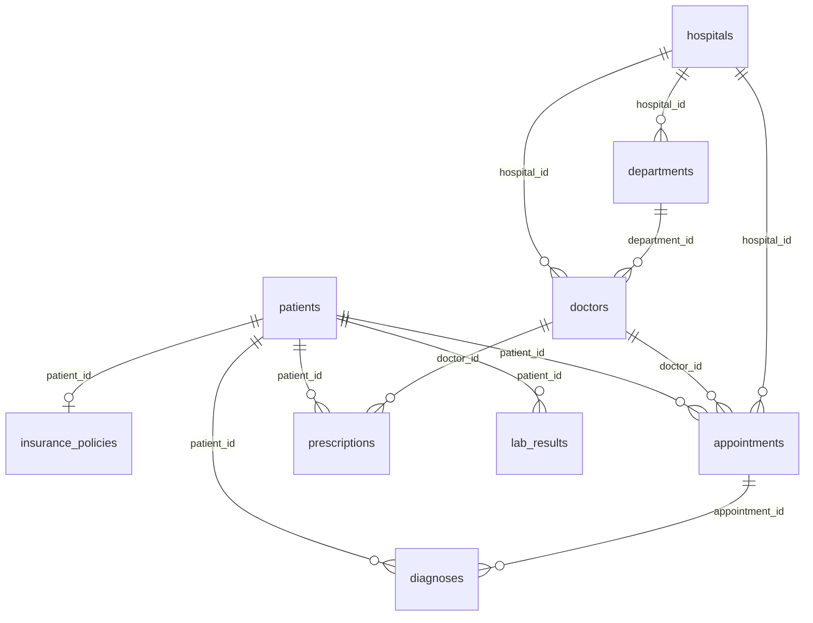

# Clinical / Healthcare

> ⚠️ **SYNTHETIC DATA.** Every record in this repository is invented. No real people, patients, accounts, vehicles or students appear here. See [synthetic-data-guarantees.md](../synthetic-data-guarantees.md).

## What is this?

A synthetic hospital network spanning twenty-five sites across Spain, with three years of appointments, diagnoses, prescriptions and blood test results. Exact row counts are in the table below, which is generated from the data itself and therefore always current.

The diagnosis codes are genuine ICD-10 codes and the laboratory codes are genuine LOINC codes -- both are public international standards rather than patient data, which means you can test a real terminology lookup against them. Everything else, every person and every hospital, is invented.

Laboratory values are generated from age-adjusted distributions, so the data is genuinely usable for demonstrating analysis rather than only for testing that your CSV parser works.

## Tables at a glance

| Table | Rows | One row is... |
|---|---:|---|
| [`hospitals`](#hospitals) | 25 | hospital site. |
| [`departments`](#departments) | 120 | clinical department within one hospital. |
| [`doctors`](#doctors) | 250 | doctor practising at one hospital. |
| [`patients`](#patients) | 800 | person registered in this dataset. |
| [`insurance_policies`](#insurance_policies) | 720 | insurance policy held by one patient. |
| [`appointments`](#appointments) | 3,500 | booked appointment between a patient and a doctor. |
| [`diagnoses`](#diagnoses) | 2,200 | diagnosis recorded at one completed appointment. |
| [`prescriptions`](#prescriptions) | 2,800 | medication prescribed to one patient by one doctor. |
| [`lab_results`](#lab_results) | 5,000 | individual laboratory measurement. |

## How the tables relate

Arrows point from the table that *owns* a row to the tables that *reference* it. Every foreign key in this diagram resolves -- there are no orphan rows anywhere in this topic.

*Full-size: [`png/clinical/erd.png`](../../png/clinical/erd.png) &middot; source: [`erd.dot`](../../png/clinical/erd.dot). Both are generated from the schema, so they cannot go stale.*

Same diagram as Mermaid (renders inline on GitHub, without the columns)

## Where to get it

| Format | Path | Pinned download |
|---|---|---|
| `csv` | [`csv/clinical/`](../../csv/clinical/) | [`hospitals.csv`](https://cdn.jsdelivr.net/gh/jasocami/realistic-test-data@v0.1.0/csv/clinical/hospitals.csv) |
| `json` | [`json/clinical/`](../../json/clinical/) | [`hospitals.json`](https://cdn.jsdelivr.net/gh/jasocami/realistic-test-data@v0.1.0/json/clinical/hospitals.json) |
| `db` | [`db/clinical/`](../../db/clinical/) | [`clinical.sqlite`](https://cdn.jsdelivr.net/gh/jasocami/realistic-test-data@v0.1.0/db/clinical/clinical.sqlite) |
| `png` | [`png/clinical/`](../../png/clinical/) | [`hospitals.png`](https://cdn.jsdelivr.net/gh/jasocami/realistic-test-data@v0.1.0/png/clinical/hospitals.png) |

See [linking-files.md](../linking-files.md) for how to use these links from Python, JavaScript, SQL or the command line.

## Column dictionary

Every column, what it means, and whether it can be empty.

### `hospitals`

**25 rows.** One row per hospital site.

The physical sites in this dataset. Everything else in the clinical topic ultimately hangs off a hospital: departments belong to one, doctors work at one, and appointments take place at one.

| Column | Type | Null | Description |
|---|---|:---:|---|
| `id` | `integer` **PK** |  | Surrogate primary key, sequential from 1. This is the column everything else joins against. Example: `1` |
| `name` | `string` unique |  | The hospital's name, following real Spanish naming conventions -- a religious dedication, the city it serves, or a role descriptor such as Universitario or Comarcal. The dedications are invented, so no row names an existing institution. Example: `Hospital Universitario San Anselmo` |
| `type` | `enum` |  | What kind of hospital this is. Teaching hospitals are attached to a medical school and tend to be larger; Specialist sites cover a single discipline. Example: `General` One of: `Children's`, `Community`, `General`, `Specialist`, `Teaching` |
| `city` | `string` |  | Spanish city the hospital is located in. These are real municipalities, weighted by population, so geocoding and mapping integrations work against them. Example: `Sevilla` |
| `province` | `enum` |  | The province the city belongs to. Always consistent with the first two digits of the postal code, since both are derived from the same choice of city. Example: `Sevilla` One of: `A Coruña`, `Albacete`, `Alicante`, `Almería`, `Asturias`, `Badajoz`, `Baleares`, `Barcelona`, `Bizkaia`, `Burgos`, `Cantabria`, `Castellón`, `Ceuta`, `Ciudad Real`, `Cuenca`, `Cáceres`, `Cádiz`, `Córdoba`, `Gipuzkoa`, `Girona`, `Granada`, `Guadalajara`, `Huelva`, `Huesca`, `Jaén`, `La Rioja`, `Las Palmas`, `León`, `Lleida`, `Lugo`, `Madrid`, `Melilla`, `Murcia`, `Málaga`, `Navarra`, `Ourense`, `Palencia`, `Pontevedra`, `Salamanca`, `Santa Cruz de Tenerife`, `Segovia`, `Sevilla`, `Soria`, `Tarragona`, `Teruel`, `Toledo`, `Valencia`, `Valladolid`, `Zamora`, `Zaragoza`, `Álava`, `Ávila` |
| `address` | `string` |  | Street address in Spanish format, with the number after the street name. Invented -- the street and number combination is not a real building. Example: `Avenida de la Constitución, 47` |
| `postal_code` | `string` |  | Spanish postal code. The first two digits are the province code (28 Madrid, 08 Barcelona, 41 Sevilla), so this always agrees with the province column. Example: `41001` Matches `^\d{5}$` |
| `phone` | `string` |  | Switchboard number in Spanish format. The dialling prefix matches the province -- 91 Madrid, 93 Barcelona, 954 Sevilla -- so the number agrees with the address beside it. Example: `+34 954 21 08 33` |
| `beds` | `integer` _beds_ |  | Inpatient bed capacity, between 40 and 900 and correlated with hospital type -- teaching hospitals are the largest, community hospitals the smallest. Example: `420` |
| `founded` | `integer` _year_ |  | Calendar year the site first opened to patients, spread between 1890 and 2015. Older sites tend to be the larger General and Teaching hospitals. Example: `1962` |

**Notes**

- Bed counts correlate with `type`: Teaching hospitals average around 700 beds, Community hospitals around 120. If you group by type and average the beds, you get a sensible-looking chart.

### `departments`

**120 rows.** One row per clinical department within one hospital.

Departments divide a hospital into clinical specialties. The same department name appears at many hospitals -- 'Cardiology' exists at most of them -- so a department is identified by the pair (hospital_id, name), not by name alone.

| Column | Type | Null | Description |
|---|---|:---:|---|
| `id` | `integer` **PK** |  | Surrogate primary key, sequential from 1. Example: `1` |
| `hospital_id` | `integer` → `hospitals.id` |  | The hospital this department belongs to. Every department belongs to exactly one site. Example: `1` |
| `name` | `enum` |  | Department name, drawn from a fixed list of twelve clinical specialties so that the same names recur across hospitals and can be grouped. Example: `Cardiology` One of: `Cardiology`, `Dermatology`, `Emergency`, `General Surgery`, `Internal Medicine`, `Neurology`, `Obstetrics & Gynaecology`, `Oncology`, `Orthopaedics`, `Paediatrics`, `Psychiatry`, `Radiology` |
| `floor` | `integer` |  | Which floor of the building the department occupies, from 0 (ground) to 8. Example: `3` |
| `phone_extension` | `string` |  | Internal four-digit extension. Not dialable from outside; this is the number staff would use. Example: `4417` |

**Notes**

- Not every hospital has every department. Smaller Community hospitals carry a handful; Teaching hospitals carry most of the list. This is why a naive cross join of hospitals and department names would give you more rows than exist here.

### `doctors`

**250 rows.** One row per doctor practising at one hospital.

Clinicians who see patients. Each doctor is attached to exactly one department at one hospital, and their specialty is always consistent with that department -- you will not find a paediatrician filed under Cardiology.

| Column | Type | Null | Description |
|---|---|:---:|---|
| `id` | `integer` **PK** |  | Surrogate primary key, sequential from 1. Example: `1` |
| `hospital_id` | `integer` → `hospitals.id` |  | The hospital this doctor works at. Denormalised alongside department_id on purpose, so you can filter doctors by site without a second join -- and so there is something to test a consistency check against. Example: `1` |
| `department_id` | `integer` → `departments.id` |  | The department this doctor works in. Always belongs to the same hospital as hospital_id. Example: `1` |
| `full_name` | `string` |  | Display name including the Spanish title, which is gendered: Dr. for men and Dra. for women. Spanish people carry two surnames -- the father's then the mother's -- which is worth testing any name parser against. Example: `Dra. Lucía Fernández Ruiz` |
| `specialty` | `string` |  | The doctor's sub-specialty. Always one that belongs to their department -- see the DEPARTMENTS table at the top of generators/topics/clinical.py. Example: `Interventional Cardiology` |
| `license_number` | `string` unique |  | Professional registration number. Invented format that deliberately does not match any real medical board's numbering scheme. Example: `LIC-0000042` Matches `^LIC-\d{7}$` |
| `email` | `string` |  | Work email address, derived from the first name and the first surname with accents transliterated away (María becomes maria). Always on example.org, a domain reserved by the IETF for documentation, so nothing sent here could reach a real inbox. Example: `lucia.fernandez@example.org` |
| `hired_at` | `date` |  | Date the doctor joined this hospital. Always at least 25 years after their notional date of birth, so no doctor in this dataset qualified as a child. Example: `2016-09-01` |
| `qualification` | `enum` |  | Spanish medical credentials, consistent with the hire date: Licenciatura for doctors who qualified before the Bologna reform and Grado only for those hired from 2016 onward, since the degree did not exist before then. 'Esp. vía MIR' marks the competitive specialty residency. Example: `Lic. Medicina, Esp. vía MIR` One of: `Lic. Medicina`, `Grado en Medicina`, `Dr. en Medicina`, `Lic. Medicina, Esp. vía MIR`, `Grado en Medicina, Esp. vía MIR`, `Dr. en Medicina, Esp. vía MIR` |

### `patients`

**800 rows.** One row per person registered in this dataset.

The anchor table of the clinical topic. Appointments, diagnoses, prescriptions, lab results and insurance policies all point back here. If you are exploring this topic for the first time, start with this table and follow the foreign keys outward.

| Column | Type | Null | Description |
|---|---|:---:|---|
| `id` | `integer` **PK** |  | Surrogate primary key, sequential from 1. Use this for joins. Example: `42` |
| `mrn` | `string` unique |  | Medical Record Number -- the hospital's own permanent identifier for a patient, and the number printed on a wristband. Real hospitals identify patients by MRN rather than by name, because names are ambiguous, change, and are frequently misspelled. Example: `MRN-0000042` Matches `^MRN-\d{7}$` |
| `full_name` | `string` |  | The patient's full name: given name, father's surname, mother's surname, as Spanish names are constructed. Invented; any resemblance to a real person is coincidental and unavoidable given finite name lists. Example: `María Fernández Ruiz` |
| `date_of_birth` | `date` |  | Date of birth in ISO-8601 format. Ages as of 2025-06-30 span 0 to 98 and follow a realistic population pyramid, so there are many more 40-year-olds than 95-year-olds. Example: `1974-03-11` |
| `sex` | `enum` |  | Recorded biological sex, used here only because several laboratory reference ranges differ by it. Split roughly evenly. Example: `F` One of: `F`, `M` |
| `blood_type` | `enum` |  | ABO and Rh blood group, distributed by real-world frequency: O+ is about 37% of rows and AB- under 1%. A histogram of this column looks like a real one. Example: `O+` One of: `A+`, `A-`, `AB+`, `AB-`, `B+`, `B-`, `O+`, `O-` |
| `phone` | `string` | ✓ | Contact telephone in Spanish format. About three quarters are mobiles (6xx or 7xx, which carry no geographic meaning); the rest are landlines whose prefix matches the patient's province. Empty for about 5% of patients, because real registration data has gaps. Example: `+34 612 34 56 78` |
| `email` | `string` | ✓ | Contact email on the reserved example.com domain, built from the given name and first surname with accents stripped. Empty for about 12% of patients -- older patients are noticeably more likely to have none, as in reality. Example: `maria.fernandez@example.com` |
| `address` | `string` |  | Street address in Spanish format: street name first, then the number, then an optional floor and door for flats. Invented -- not a real dwelling. Example: `Calle Mayor, 47, 3º B` |
| `city` | `string` |  | Spanish city of residence, weighted by real population. Not necessarily the same city as the hospital the patient attends. Example: `Sevilla` |
| `province` | `enum` |  | Province of residence. Always matches the first two digits of the postal code, so address validation that cross-checks the two will pass on this data. Example: `Sevilla` One of: `A Coruña`, `Albacete`, `Alicante`, `Almería`, `Asturias`, `Badajoz`, `Baleares`, `Barcelona`, `Bizkaia`, `Burgos`, `Cantabria`, `Castellón`, `Ceuta`, `Ciudad Real`, `Cuenca`, `Cáceres`, `Cádiz`, `Córdoba`, `Gipuzkoa`, `Girona`, `Granada`, `Guadalajara`, `Huelva`, `Huesca`, `Jaén`, `La Rioja`, `Las Palmas`, `León`, `Lleida`, `Lugo`, `Madrid`, `Melilla`, `Murcia`, `Málaga`, `Navarra`, `Ourense`, `Palencia`, `Pontevedra`, `Salamanca`, `Santa Cruz de Tenerife`, `Segovia`, `Sevilla`, `Soria`, `Tarragona`, `Teruel`, `Toledo`, `Valencia`, `Valladolid`, `Zamora`, `Zaragoza`, `Álava`, `Ávila` |
| `postal_code` | `string` |  | Spanish postal code, five digits. The leading pair is the province code and runs from 01 (Álava) to 52 (Melilla) -- codes like 00123 or 53001 do not exist and are only found in the _edge-cases folders. Example: `41001` Matches `^\d{5}$` |
| `registered_at` | `date` |  | Date the patient was first registered at any hospital in the dataset. Always on or before their first appointment. Example: `2023-02-17` |

**Notes**

- Ages are drawn from a population pyramid rather than uniformly. That matters more than it sounds: age drives the laboratory results, so getting the age distribution right is what makes the lab data look clinically plausible when you plot it.
- Roughly 10% of patients have no insurance policy at all. They are the patients with no matching row in `insurance_policies` -- a deliberate LEFT JOIN test case.

### `insurance_policies`

**720 rows.** One row per insurance policy held by one patient.

Health insurance cover. Roughly 90% of patients hold exactly one policy and the remainder hold none, so this table is a natural test case for LEFT JOIN behaviour and for code that assumes every patient is insured.

| Column | Type | Null | Description |
|---|---|:---:|---|
| `id` | `integer` **PK** |  | Surrogate primary key, sequential from 1. Example: `1` |
| `patient_id` | `integer` → `patients.id` unique |  | The patient this policy covers. Unique, because in this dataset a patient holds at most one policy. Example: `42` |
| `provider` | `enum` |  | Insurer name. All eight are invented companies; none corresponds to a real insurance business. Example: `Northwind Health` One of: `Arcadia Health Plan`, `Blue Harbour Cover`, `Caldera Care`, `Lakeview Assurance`, `Meridian Mutual`, `Northwind Health`, `Pinefield Medical`, `Stonebridge Health` |
| `policy_number` | `string` unique |  | The insurer's reference for this policy, as it would be quoted on a claim. Example: `POL-00004217` Matches `^POL-\d{8}$` |
| `coverage_level` | `enum` |  | Tier of cover, from Basic to Comprehensive. Weighted towards the cheaper tiers, as real policy mixes are. Example: `Standard` One of: `Basic`, `Comprehensive`, `Premium`, `Standard` |
| `annual_premium` | `decimal` _USD_ |  | What the policy costs per year. Correlates with coverage level and with the patient's age, so a scatter plot of premium against age slopes upward. Example: `2480.0` |
| `valid_from` | `date` |  | Date cover began. Always on or after the start of the dataset period, 2023-01-01. Example: `2023-01-01` |
| `valid_until` | `date` |  | Date cover expires. Always after valid_from, typically by one to three years. Example: `2026-01-01` |

### `appointments`

**3,500 rows.** One row per booked appointment between a patient and a doctor.

The central activity table. Every appointment links a patient to a doctor at a hospital on a date. Appointments before 2025-06-30 have already happened and carry a final status; later ones are still scheduled.

| Column | Type | Null | Description |
|---|---|:---:|---|
| `id` | `integer` **PK** |  | Surrogate primary key, sequential from 1. Example: `1` |
| `patient_id` | `integer` → `patients.id` |  | The patient the appointment is for. Never earlier than that patient's registered_at date. Example: `42` |
| `doctor_id` | `integer` → `doctors.id` |  | Which clinician the patient is booked to see. Determines the hospital column below, since an appointment always takes place where that clinician works. Example: `17` |
| `hospital_id` | `integer` → `hospitals.id` |  | Where the appointment takes place. Always the hospital the doctor works at -- a consistency rule the test suite checks explicitly. Example: `1` |
| `scheduled_at` | `datetime` |  | Appointment date and time. Always on a weekday, between 08:00 and 17:30, on a 15-minute boundary -- because that is how clinic slots actually work. Example: `2024-06-14T09:30:00` |
| `duration_minutes` | `integer` _minutes_ |  | Slot length: 15, 20, 30, 45 or 60 minutes. New referrals get longer slots than follow-ups. Example: `30` |
| `status` | `enum` |  | Outcome. Past appointments are about 78% completed, 10% cancelled and 7% no-shows; future ones are always 'scheduled'. The no-show rate is deliberately realistic -- it is a real operational problem and a common thing to build a dashboard about. Example: `completed` One of: `scheduled`, `completed`, `cancelled`, `no_show` |
| `reason` | `enum` |  | Why the appointment was booked, drawn from the ten reasons that dominate real outpatient scheduling. Example: `Follow-up consultation` One of: `Acute symptoms`, `Annual screening`, `Follow-up consultation`, `Medication review`, `New referral`, `Post-operative review`, `Pre-operative assessment`, `Routine check-up`, `Second opinion`, `Test results discussion` |
| `notes` | `text` | ✓ | Free-text clinical note. Present on about 60% of completed appointments and never on cancellations, which makes this a good column for testing nullable text handling and full-text search. Example: `Patient reports improvement since last review.` |

**Notes**

- `hospital_id` is intentionally derivable from `doctor_id`. It is stored anyway because real schemas denormalise for query speed, and because it gives you a genuine consistency invariant to test: every appointment's hospital must match its doctor's hospital.
- Appointment times cluster on weekday mornings. If you plot a histogram by hour you get the double-humped shape of a real clinic day, with a dip over lunch.

### `diagnoses`

**2,200 rows.** One row per diagnosis recorded at one completed appointment.

Conditions recorded against a patient, coded with real ICD-10 codes. Only completed appointments produce diagnoses -- a cancelled visit cannot diagnose anything, which is a rule worth testing joins against.

| Column | Type | Null | Description |
|---|---|:---:|---|
| `id` | `integer` **PK** |  | Surrogate primary key, sequential from 1. Example: `1` |
| `patient_id` | `integer` → `patients.id` |  | The patient diagnosed. Denormalised from the appointment so you can count diagnoses per patient without a second join. Example: `42` |
| `appointment_id` | `integer` → `appointments.id` |  | The appointment at which this diagnosis was recorded. Always an appointment whose status is 'completed'. Example: `88` |
| `icd10_code` | `string` |  | The diagnosis code. These are genuine ICD-10 codes from the WHO's public classification, so you can look any of them up in an ICD browser and get the same description that appears in the next column. Example: `E11.9` |
| `description` | `string` |  | The official ICD-10 description for the code. Stored alongside rather than looked up, which is what most real clinical systems do so that a historical record keeps its original wording when the code set is revised. Example: `Type 2 diabetes mellitus without complications` |
| `severity` | `enum` |  | Clinical severity. Weighted towards mild and moderate, as a real outpatient caseload is. Example: `moderate` One of: `mild`, `moderate`, `severe` |
| `diagnosed_at` | `date` |  | Date of diagnosis. Always the same date as the referenced appointment. Example: `2024-06-14` |
| `is_chronic` | `boolean` |  | Whether this is an ongoing condition rather than an acute episode. Derived from the code: diabetes and hypertension are chronic, a fracture is not. Example: `true` |

### `prescriptions`

**2,800 rows.** One row per medication prescribed to one patient by one doctor.

Medicines prescribed during the period. Drug names are generic (non-brand) international nonproprietary names, which is what appears on a real prescription and carries no trademark.

| Column | Type | Null | Description |
|---|---|:---:|---|
| `id` | `integer` **PK** |  | Surrogate primary key, sequential from 1. Example: `1` |
| `patient_id` | `integer` → `patients.id` |  | The patient the medication is for. A patient may hold several concurrent prescriptions. Example: `42` |
| `doctor_id` | `integer` → `doctors.id` |  | The doctor who issued the prescription. Not necessarily one the patient has an appointment with. Example: `17` |
| `medication` | `string` |  | Generic drug name. Eighteen common medications, weighted so that the drugs prescribed most often in reality appear most often here. Example: `Metformin` |
| `dosage` | `string` |  | Strength per dose, always one that the medication is genuinely dispensed in -- you will not find a 37 mg Metformin tablet. Example: `500 mg` |
| `frequency` | `string` |  | Dosing instruction as it would be written on the label, matched to the medication. Example: `Twice daily with meals` |
| `start_date` | `date` |  | Date the course begins. Always on or after the patient's registration date. Example: `2024-06-14` |
| `end_date` | `date` | ✓ | Date the course ends. Empty for repeat prescriptions of chronic medication, which is about 45% of rows -- an open-ended course is the normal case for something like a blood pressure tablet. Example: `2024-07-14` |
| `refills_allowed` | `integer` |  | How many times the prescription can be re-dispensed without a new consultation, from 0 to 11. Example: `3` |

### `lab_results`

**5,000 rows.** One row per individual laboratory measurement.

Blood and urine test results, coded with real LOINC codes. This is the largest table in the topic and the most useful one for charting, because the values are generated from age-adjusted distributions rather than at random.

| Column | Type | Null | Description |
|---|---|:---:|---|
| `id` | `integer` **PK** |  | Surrogate primary key, sequential from 1. Example: `1` |
| `patient_id` | `integer` → `patients.id` |  | The patient the sample was taken from. Their age drives the value in the `value` column. Example: `42` |
| `loinc_code` | `string` |  | The LOINC code identifying which test this is. LOINC is the international standard for naming laboratory observations, and these are genuine codes. Example: `4548-4` |
| `test_name` | `string` |  | Plain-language name of the assay, matching the LOINC code in the previous column. Stored alongside so a reader can interpret a result without consulting a terminology server. Example: `Haemoglobin A1c` |
| `value` | `decimal` |  | The measured result, to two decimal places. Generated from a distribution whose mean shifts with the patient's age, so older patients really do show higher HbA1c and creatinine. Example: `7.4` |
| `unit` | `string` |  | Unit of measurement for the value. Always the unit the LOINC code specifies -- never assume, read this column. Example: `%` |
| `reference_low` | `decimal` |  | Lower bound of the normal range for this test. Below this the result is flagged LOW. Example: `4.0` |
| `reference_high` | `decimal` |  | Upper bound of the normal range. Above this the result is flagged HIGH. Example: `5.7` |
| `flag` | `enum` |  | Where the value sits relative to the reference range. Computed from value, reference_low and reference_high, so it is always consistent with them -- which makes it a good column for verifying your own derived-field logic against. Example: `HIGH` One of: `LOW`, `NORMAL`, `HIGH` |
| `collected_at` | `datetime` |  | When the sample was taken. Phlebotomy rounds happen early, so these cluster between 07:00 and 10:00. Example: `2024-06-14T08:15:00` |

**Notes**

- About 18% of results fall outside their reference range. That is higher than a healthy population but realistic for a hospital dataset, where people are tested because something is suspected.
- The `flag` column is fully derivable from `value`, `reference_low` and `reference_high`. It is stored anyway -- as real lab systems do -- which makes it a ready-made exercise: recompute it yourself and check you get the same answer for all 8,000 rows.

---

*This page is generated from the schema definitions in `generators/topics/clinical.py`. Do not edit it by hand -- your changes would be overwritten on the next build. Edit the `description=` on the relevant `Field` instead, and run `python build.py`.*
