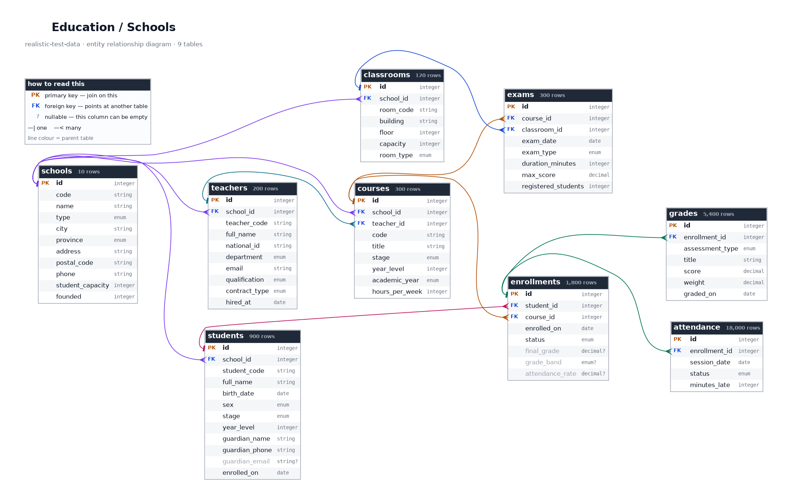
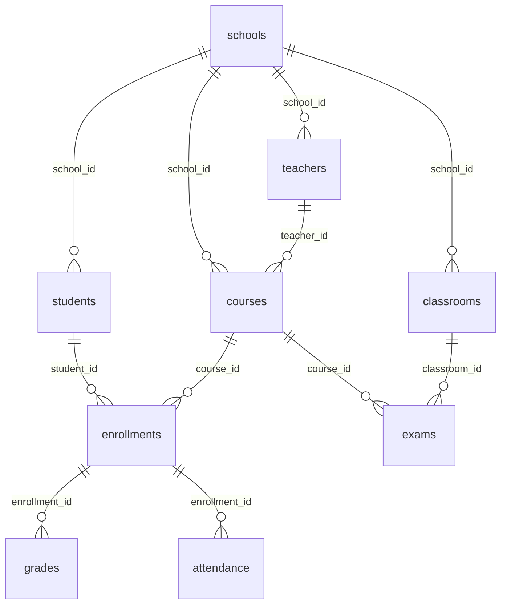

# Education / Schools

> ⚠️ **SYNTHETIC DATA.** Every record in this repository is invented. No real people, patients, accounts, vehicles or students appear here. See [synthetic-data-guarantees.md](../synthetic-data-guarantees.md).

## What is this?

A Spanish school system: state and private centres across Primaria, ESO, Bachillerato and FP, with three academic years of enrolments, grades and attendance.

This is the topic to reach for when you need data with something in it to FIND. Every pupil carries a hidden diligence factor that drives both how often they attend and how well they score, and that factor is never published -- so the correlation between attendance and achievement is genuinely emergent rather than computed. Plot one against the other and a real relationship appears, with realistic scatter. Random data gives you nothing to discover.

Grades use the Spanish 0-10 scale where 5 is a pass, with the named bands a report card actually prints. Assessment weights within an enrolment sum to exactly 1.00 and the final grade is exactly that weighted sum.

## Tables at a glance

| Table | Rows | One row is... |
|---|---:|---|
| [`schools`](#schools) | 10 | school centre in the network. |
| [`classrooms`](#classrooms) | 120 | teaching room in one school. |
| [`teachers`](#teachers) | 200 | member of teaching staff. |
| [`courses`](#courses) | 300 | course taught in one academic year. |
| [`students`](#students) | 900 | enrolled pupil. |
| [`enrollments`](#enrollments) | 1,800 | pupil enrolled on one course. |
| [`grades`](#grades) | 5,400 | assessment component of one enrolment. |
| [`attendance`](#attendance) | 18,000 | pupil per recorded teaching session. |
| [`exams`](#exams) | 300 | scheduled examination sitting. |

## How the tables relate

Arrows point from the table that *owns* a row to the tables that *reference* it. Every foreign key in this diagram resolves -- there are no orphan rows anywhere in this topic.

*Full-size: [`png/education/erd.png`](../../png/education/erd.png) &middot; source: [`erd.dot`](../../png/education/erd.dot). Both are generated from the schema, so they cannot go stale.*

Same diagram as Mermaid (renders inline on GitHub, without the columns)

## Where to get it

| Format | Path | Pinned download |
|---|---|---|
| `csv` | [`csv/education/`](../../csv/education/) | [`schools.csv`](https://cdn.jsdelivr.net/gh/jasocami/realistic-test-data@v0.1.0/csv/education/schools.csv) |
| `json` | [`json/education/`](../../json/education/) | [`schools.json`](https://cdn.jsdelivr.net/gh/jasocami/realistic-test-data@v0.1.0/json/education/schools.json) |
| `db` | [`db/education/`](../../db/education/) | [`education.sqlite`](https://cdn.jsdelivr.net/gh/jasocami/realistic-test-data@v0.1.0/db/education/education.sqlite) |
| `png` | [`png/education/`](../../png/education/) | [`schools.png`](https://cdn.jsdelivr.net/gh/jasocami/realistic-test-data@v0.1.0/png/education/schools.png) |

See [linking-files.md](../linking-files.md) for how to use these links from Python, JavaScript, SQL or the command line.

## Column dictionary

Every column, what it means, and whether it can be empty.

### `schools`

**10 rows.** One row per school centre in the network.

The institutions themselves. Teachers, classrooms, courses and students all belong to exactly one school, so this is the root of the whole topic.

| Column | Type | Null | Description |
|---|---|:---:|---|
| `id` | `integer` **PK** |  | Surrogate primary key, sequential from 1. Every other table in this topic joins against it. Example: `1` |
| `code` | `string` unique |  | Centre code in the format Spanish education authorities use: two digits for the province, then six identifying the centre. Invented, but structurally correct. Example: `41000123` Matches `^\d{8}$` |
| `name` | `string` unique |  | School name, following real Spanish conventions -- the centre type followed by a person or place name. All invented. Example: `IES Miguel de Unamuno` |
| `type` | `enum` |  | Centre type. CEIP is state primary, IES state secondary, Concertado privately run but state funded, and Privado fully independent. The type determines which stages the school teaches. Example: `IES` One of: `CEIP`, `Concertado`, `IES`, `Privado` |
| `city` | `string` |  | Spanish city the school is in, drawn from real municipalities weighted by population. Example: `Sevilla` |
| `province` | `enum` |  | Province the school sits in, always consistent with the first two digits of its postal code. Example: `Sevilla` One of: `A Coruña`, `Albacete`, `Alicante`, `Almería`, `Asturias`, `Badajoz`, `Baleares`, `Barcelona`, `Bizkaia`, `Burgos`, `Cantabria`, `Castellón`, `Ceuta`, `Ciudad Real`, `Cuenca`, `Cáceres`, `Cádiz`, `Córdoba`, `Gipuzkoa`, `Girona`, `Granada`, `Guadalajara`, `Huelva`, `Huesca`, `Jaén`, `La Rioja`, `Las Palmas`, `León`, `Lleida`, `Lugo`, `Madrid`, `Melilla`, `Murcia`, `Málaga`, `Navarra`, `Ourense`, `Palencia`, `Pontevedra`, `Salamanca`, `Santa Cruz de Tenerife`, `Segovia`, `Sevilla`, `Soria`, `Tarragona`, `Teruel`, `Toledo`, `Valencia`, `Valladolid`, `Zamora`, `Zaragoza`, `Álava`, `Ávila` |
| `address` | `string` |  | Street address in Spanish format, with the number after the street name. Invented. Example: `Calle de la Constitución, 24` |
| `postal_code` | `string` |  | Spanish postal code whose leading pair encodes the province, so the two columns always agree. Example: `41004` Matches `^\d{5}$` |
| `phone` | `string` |  | School office number, carrying the dialling prefix of the province it is in. Example: `+34 954 22 41 08` |
| `student_capacity` | `integer` _students_ |  | How many pupils the site can hold, correlated with centre type -- a CEIP is far smaller than an IES. Example: `850` |
| `founded` | `integer` _year_ |  | Calendar year the centre first admitted pupils, spread between 1900 and 2018. No teacher in this dataset was hired before their own school existed. Example: `1974` |

### `classrooms`

**120 rows.** One row per teaching room in one school.

Physical rooms. Exams are scheduled into a classroom, which is what makes this table useful for testing timetabling and room-clash detection.

| Column | Type | Null | Description |
|---|---|:---:|---|
| `id` | `integer` **PK** |  | Surrogate primary key, sequential from 1. Example: `1` |
| `school_id` | `integer` → `schools.id` |  | Which school the room is in. Rooms are never shared between centres. Example: `1` |
| `room_code` | `string` |  | Room reference as it appears on a timetable: a building letter, then the floor and room number. Example: `A-204` |
| `building` | `string` |  | Which building on the site, in Spanish. Larger schools have several; small ones have only one. Example: `Edificio A` |
| `floor` | `integer` |  | Which floor the room is on, from 0 for the ground floor up to 3. Example: `2` |
| `capacity` | `integer` _seats_ |  | How many students the room seats, typically between 15 for a specialist lab and 40 for a lecture room. Example: `30` |
| `room_type` | `enum` |  | What the room is equipped for. Standard classrooms dominate; labs and workshops are attached to the subjects that need them. Example: `standard` One of: `standard`, `laboratory`, `computer_lab`, `workshop`, `gym`, `music` |

### `teachers`

**200 rows.** One row per member of teaching staff.

Teachers, each attached to one school and one department. A teacher leads several courses, which is how this table connects to the rest of the topic.

| Column | Type | Null | Description |
|---|---|:---:|---|
| `id` | `integer` **PK** |  | Surrogate primary key, sequential from 1. Example: `1` |
| `school_id` | `integer` → `schools.id` |  | Which school employs this teacher. Everybody is attached to exactly one centre in this dataset. Example: `1` |
| `teacher_code` | `string` unique |  | Staff reference used on timetables and internal systems, quoted instead of the numeric id. Example: `PRF-00042` Matches `^PRF-\d{5}$` |
| `full_name` | `string` |  | Spanish name with two surnames, the father's then the mother's. A useful stress test for any code that assumes one surname. Example: `Ana Belén Ortega Ruiz` |
| `national_id` | `string` unique |  | Spanish DNI, eight digits and a check letter derived modulo 23, so it passes a real validator while belonging to nobody. Example: `12345678Z` Matches `^\d{8}[A-Z]$` |
| `department` | `enum` |  | Departmental grouping the teacher belongs to. Courses they lead are always in a subject that department covers. Example: `Matemáticas` One of: `Artes`, `Ciencias`, `Ciencias Sociales`, `Educación Física`, `Formación Profesional`, `Idiomas`, `Lengua y Literatura`, `Matemáticas`, `Orientación`, `Tecnología` |
| `email` | `string` |  | Work address on the reserved example.org domain, built from the name with accents transliterated away. Example: `ana.ortega@example.org` |
| `qualification` | `enum` |  | Teaching credential. Spain requires a subject degree plus the Máster en Formación del Profesorado to teach secondary; primary teachers hold a dedicated Grado en Educación Primaria. Example: `Grado + Máster en Formación del Profesorado` One of: `Doctorado`, `Grado + Máster en Formación del Profesorado`, `Grado en Educación Primaria`, `Licenciatura + CAP`, `Técnico Superior FP` |
| `contract_type` | `enum` |  | Employment status. 'interim' covers the substantial share of Spanish teachers on year-to-year interim appointments rather than tenured posts. Example: `permanent` One of: `interim`, `permanent`, `temporary` |
| `hired_at` | `date` |  | Start date, always the first of September because Spanish teaching contracts begin with the academic year, and never before the school was founded. Example: `2015-09-01` |

### `courses`

**300 rows.** One row per course taught in one academic year.

A subject taught at a particular year-group level by a particular teacher in a particular academic year. The same subject at the same level in two different years is two rows, because the enrolments and grades differ.

| Column | Type | Null | Description |
|---|---|:---:|---|
| `id` | `integer` **PK** |  | Surrogate primary key, sequential from 1. Example: `1` |
| `school_id` | `integer` → `schools.id` |  | Which school runs the course. Always the same school as the teacher who leads it. Example: `1` |
| `teacher_id` | `integer` → `teachers.id` |  | Who teaches it. Always someone whose department covers this subject and who works at this school. Example: `7` |
| `code` | `string` unique |  | Course code, three letters from the subject plus a sequence -- the format that appears on a timetable and a report card. Example: `MAT-00142` Matches `^[A-Z]{3}-\d{5}$` |
| `title` | `string` |  | Subject name in Spanish, drawn from the real curriculum for the stage the course belongs to. Example: `Matemáticas II` |
| `stage` | `enum` |  | Educational stage: Primaria for ages 6-12, ESO for compulsory secondary, Bachillerato for pre-university, FP for vocational training. Example: `Bachillerato` One of: `Bachillerato`, `ESO`, `FP`, `Primaria` |
| `year_level` | `integer` |  | Which year within the stage, numbered from 1. Primaria runs 1 to 6, ESO 1 to 4, Bachillerato and FP 1 to 2, exactly as the Spanish system does. Example: `2` |
| `academic_year` | `enum` |  | The school year the course ran in, written the Spanish way as a span from September to June. Example: `2024/2025` One of: `2022/2023`, `2023/2024`, `2024/2025` |
| `hours_per_week` | `integer` _hours_ |  | Timetabled contact hours per week, from 1 for a minor subject to 5 for a core one like Matemáticas or Lengua. Example: `4` |

### `students`

**900 rows.** One row per enrolled pupil.

The pupils. Enrolments, grades and attendance all point back here, and the guardian contact details are what a parent portal would use.

| Column | Type | Null | Description |
|---|---|:---:|---|
| `id` | `integer` **PK** |  | Surrogate primary key, sequential from 1. Use this for joins rather than the student code. Example: `1` |
| `school_id` | `integer` → `schools.id` |  | Which school the pupil attends. Always a school that teaches a stage appropriate to their age. Example: `1` |
| `student_code` | `string` unique |  | The pupil's reference at the centre, printed on a student card and used on every internal list. Example: `ALU-000042` Matches `^ALU-\d{6}$` |
| `full_name` | `string` |  | Spanish name with both surnames, as it appears on the school register. Example: `Lucía Serrano Gil` |
| `birth_date` | `date` |  | Date of birth. Always consistent with the stage the pupil is enrolled in -- a Bachillerato student is 16 to 18, a Primaria pupil 6 to 12. Example: `2010-04-22` |
| `sex` | `enum` |  | Recorded sex, split close to evenly. Present because official Spanish education statistics are reported broken down by it. Example: `F` One of: `F`, `M` |
| `stage` | `enum` |  | Which educational stage the pupil is currently in, derived from their age and consistent with the courses they are enrolled in. Example: `ESO` One of: `Bachillerato`, `ESO`, `FP`, `Primaria` |
| `year_level` | `integer` |  | Year within the stage, numbered from 1 and matching the pupil's age within that stage. Example: `3` |
| `guardian_name` | `string` |  | Parent or guardian, usually sharing one of the pupil's surnames -- which is exactly what Spanish naming produces and what a family-matching feature should be tested against. Example: `Manuel Serrano Ortiz` |
| `guardian_phone` | `string` |  | Guardian's mobile number in Spanish format. Never empty, because a school cannot enrol a minor without a contact number. Example: `+34 612 34 56 78` |
| `guardian_email` | `string` | ✓ | Guardian's email on the reserved example.com domain. Empty for about 14% of families, which is the gap any parent-portal rollout runs into. Example: `manuel.serrano@example.com` |
| `enrolled_on` | `date` |  | Date the pupil joined the school, always the start of an academic year. Example: `2022-09-12` |

**Notes**

- Guardians usually share a surname with the pupil, because Spanish children take the father's first surname. A guardian-matching heuristic can be tested against this and will find the roughly 20% of cases where it does not hold.

### `enrollments`

**1,800 rows.** One row per pupil enrolled on one course.

Which pupils take which courses, and how they did. The final grade here is exactly the weighted sum of that enrolment's rows in the grades table.

| Column | Type | Null | Description |
|---|---|:---:|---|
| `id` | `integer` **PK** |  | Surrogate primary key, sequential from 1. Example: `1` |
| `student_id` | `integer` → `students.id` |  | Who is enrolled. A pupil takes several courses in a year, so this column is far from unique. Example: `42` |
| `course_id` | `integer` → `courses.id` |  | Which course. Always one at the pupil's own school and matching their stage and year level. Example: `7` |
| `enrolled_on` | `date` |  | Date the enrolment began, always in the September the academic year started. Example: `2024-09-09` |
| `status` | `enum` |  | How the enrolment ended. Withdrawn pupils left part way through; 'repeated' marks a pupil retaking a year, which Spanish schools do more often than most European systems. Example: `completed` One of: `completed`, `in_progress`, `repeated`, `withdrawn` |
| `final_grade` | `decimal` _points (0-10)_ | ✓ | Final mark on the Spanish 0-10 scale, where 5 is a pass. Exactly the weighted sum of this enrolment's assessment rows in the grades table, rounded to two decimals. Empty while a course is still in progress. Example: `7.4` |
| `grade_band` | `enum` | ✓ | The named band the final grade falls into, as printed on a Spanish report card: Suspenso below 5, then Aprobado, Bien, Notable and Sobresaliente. Derived from final_grade, so the two always agree. Example: `Notable` One of: `Suspenso`, `Aprobado`, `Bien`, `Notable`, `Sobresaliente` |
| `attendance_rate` | `decimal` _fraction_ | ✓ | Proportion of recorded sessions the pupil attended, computed from their rows in the attendance table. Empty where no attendance was recorded. This is the column that correlates with final_grade. Example: `0.92` |

**Notes**

- This is the table to use for demonstrating analysis. Attendance and final grade are genuinely correlated, because both are driven by a hidden per-pupil diligence factor that is never stored. Plot one against the other and a real relationship appears, with realistic scatter -- something random data cannot give you.
- `final_grade` is exactly the weighted sum of the enrolment's rows in `grades`, whose weights sum to 1.00. Recomputing it yourself is a ready-made exercise, and CI checks the answer.
- A WARNING WORTH READING IF YOUR RECOMPUTATION DISAGREES. These grades are computed with exact decimal arithmetic, not floating point. Enrolment 2 has components 7.3x0.35 + 7.6x0.35 + 5.6x0.30, which is exactly 6.895 and rounds to 6.90. Ask SQLite for ROUND(SUM(score*weight), 2) and you get 6.89, because 6.895 cannot be represented exactly in binary and is stored as 6.89499... This is not an error in the data; it is the classic floating-point rounding trap, and this column is a good place to meet it.

### `grades`

**5,400 rows.** One row per assessment component of one enrolment.

The individual marks that make up a final grade: exams, coursework, practicals and participation. The weights within one enrolment always sum to exactly 1.00.

| Column | Type | Null | Description |
|---|---|:---:|---|
| `id` | `integer` **PK** |  | Surrogate primary key, sequential from 1. Example: `1` |
| `enrollment_id` | `integer` → `enrollments.id` |  | Which enrolment this mark belongs to. Grouping by this column and summing score times weight reproduces the enrolment's final grade. Example: `42` |
| `assessment_type` | `enum` |  | What was assessed. Exams carry the heaviest weight, participation the lightest, which is how a Spanish secondary course is typically structured. Example: `exam` One of: `coursework`, `exam`, `participation`, `practical` |
| `title` | `string` |  | Name of the assessment as the pupil would see it, usually naming the term it belonged to -- Spanish courses run in three trimesters. Example: `Examen 2º trimestre` |
| `score` | `decimal` _points (0-10)_ |  | Mark awarded on the Spanish 0-10 scale, to one decimal place, where 5 is a pass. Example: `7.8` |
| `weight` | `decimal` _fraction_ |  | How much this component contributes to the final grade. All the weights within one enrolment sum to exactly 1.00, which CI verifies. Example: `0.4` |
| `graded_on` | `date` |  | Date the mark was recorded, always during the academic year the course ran in. Example: `2025-03-21` |

### `attendance`

**18,000 rows.** One row per pupil per recorded teaching session.

Session-by-session attendance. This is a sample of sessions rather than every one of them, which keeps the table a sensible size while still supporting a meaningful attendance rate per enrolment.

| Column | Type | Null | Description |
|---|---|:---:|---|
| `id` | `integer` **PK** |  | Surrogate primary key, sequential from 1. Example: `1` |
| `enrollment_id` | `integer` → `enrollments.id` |  | Which pupil-on-which-course this record is for. Counting present rows against total rows per enrolment gives that enrolment's attendance rate. Example: `42` |
| `session_date` | `date` |  | Date of the session. Always a weekday during term time -- Spanish schools do not teach at weekends or through July and August. Example: `2025-02-11` |
| `status` | `enum` |  | Whether the pupil attended. 'excused' covers an absence the school accepted in advance, which is counted separately from an unexplained one in Spanish attendance reporting. Example: `present` One of: `absent`, `excused`, `late`, `present` |
| `minutes_late` | `integer` _minutes_ |  | How late the pupil arrived, zero unless the status is 'late'. Typically between 5 and 35 minutes when it is not. Example: `0` |

### `exams`

**300 rows.** One row per scheduled examination sitting.

Timetabled exams, each placed in a room at a time. Useful for testing scheduling features and room-clash detection, since the same room is used many times.

| Column | Type | Null | Description |
|---|---|:---:|---|
| `id` | `integer` **PK** |  | Surrogate primary key, sequential from 1. Example: `1` |
| `course_id` | `integer` → `courses.id` |  | Which course is being examined. A course typically has a midterm and a final, sometimes a resit. Example: `7` |
| `classroom_id` | `integer` → `classrooms.id` |  | Where the exam takes place. Always a room at the same school as the course. Example: `12` |
| `exam_date` | `date` |  | Date of the sitting, always a weekday during term time and within the course's academic year. Example: `2025-06-05` |
| `exam_type` | `enum` |  | Which kind of sitting: a midterm, the final, a practice mock, or a resit for pupils who failed first time. Example: `final` One of: `final`, `midterm`, `mock`, `resit` |
| `duration_minutes` | `integer` _minutes_ |  | How long pupils get, from 45 minutes for a short midterm to 180 for a Bachillerato final. Example: `90` |
| `max_score` | `decimal` _points_ |  | Marks available. Almost always 10, because the Spanish scale is 0 to 10, which makes the few exceptions worth handling. Example: `10.0` |
| `registered_students` | `integer` _students_ |  | How many pupils were entered for this sitting, never more than the capacity of the room it was scheduled into. Example: `28` |

---

*This page is generated from the schema definitions in `generators/topics/education.py`. Do not edit it by hand -- your changes would be overwritten on the next build. Edit the `description=` on the relevant `Field` instead, and run `python build.py`.*
