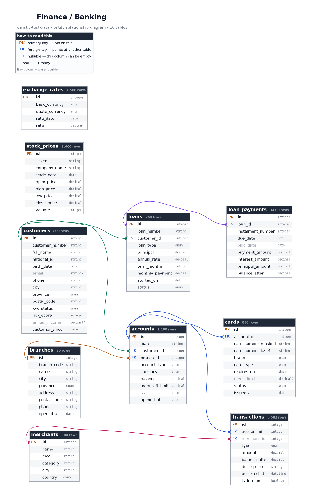
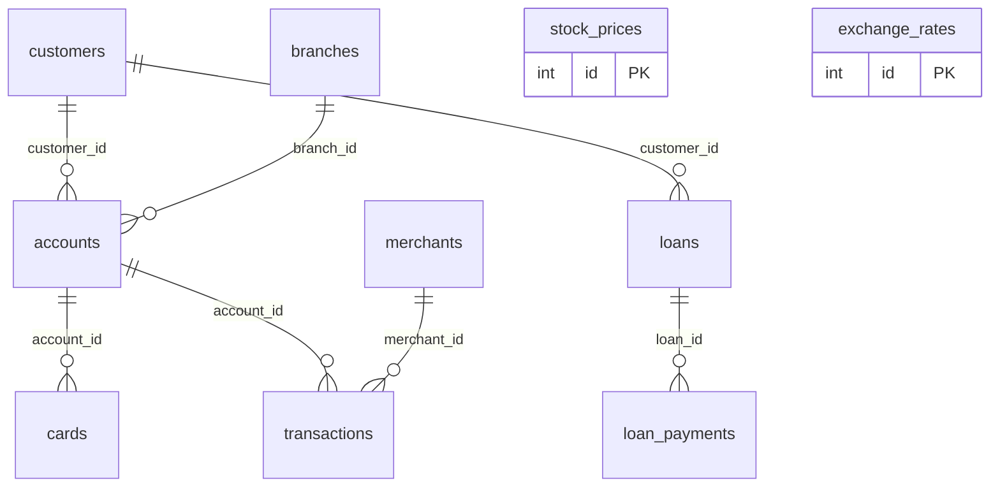

# Finance / Banking

> ⚠️ **SYNTHETIC DATA.** Every record in this repository is invented. No real people, patients, accounts, vehicles or students appear here. See [synthetic-data-guarantees.md](../synthetic-data-guarantees.md).

## What is this?

A Spanish retail bank: branches, customers, accounts, cards and two and a half years of ledger movements, plus loans with full amortisation schedules and daily price history for ten fictional listed companies.

This is the topic where the arithmetic has to hold up, and it does. Running balances are genuinely running -- order an account's transactions by time and each balance_after is the previous one plus the amount. Loan schedules amortise to exactly zero. Every IBAN passes the mod-97 check and every card number passes Luhn while coming from a published non-live test range.

Market data follows a geometric random walk with the open-high-low-close relationship intact in every row, so candlestick charts render correctly rather than as visual nonsense.

## Tables at a glance

| Table | Rows | One row is... |
|---|---:|---|
| [`branches`](#branches) | 25 | physical bank branch. |
| [`customers`](#customers) | 800 | banking customer. |
| [`accounts`](#accounts) | 1,100 | bank account. |
| [`cards`](#cards) | 850 | payment card issued against one account. |
| [`merchants`](#merchants) | 180 | business that accepts card payments. |
| [`transactions`](#transactions) | 5,582 | movement on one account. |
| [`loans`](#loans) | 280 | loan granted to one customer. |
| [`loan_payments`](#loan_payments) | 3,000 | scheduled instalment on one loan. |
| [`stock_prices`](#stock_prices) | 3,000 | ticker per trading day. |
| [`exchange_rates`](#exchange_rates) | 1,500 | currency pair per day. |

## How the tables relate

Arrows point from the table that *owns* a row to the tables that *reference* it. Every foreign key in this diagram resolves -- there are no orphan rows anywhere in this topic.

*Full-size: [`png/finance/erd.png`](../../png/finance/erd.png) &middot; source: [`erd.dot`](../../png/finance/erd.dot). Both are generated from the schema, so they cannot go stale.*

Same diagram as Mermaid (renders inline on GitHub, without the columns)

## Where to get it

| Format | Path | Pinned download |
|---|---|---|
| `csv` | [`csv/finance/`](../../csv/finance/) | [`branches.csv`](https://cdn.jsdelivr.net/gh/jasocami/realistic-test-data@v0.1.0/csv/finance/branches.csv) |
| `json` | [`json/finance/`](../../json/finance/) | [`branches.json`](https://cdn.jsdelivr.net/gh/jasocami/realistic-test-data@v0.1.0/json/finance/branches.json) |
| `db` | [`db/finance/`](../../db/finance/) | [`finance.sqlite`](https://cdn.jsdelivr.net/gh/jasocami/realistic-test-data@v0.1.0/db/finance/finance.sqlite) |
| `png` | [`png/finance/`](../../png/finance/) | [`branches.png`](https://cdn.jsdelivr.net/gh/jasocami/realistic-test-data@v0.1.0/png/finance/branches.png) |

See [linking-files.md](../linking-files.md) for how to use these links from Python, JavaScript, SQL or the command line.

## Column dictionary

Every column, what it means, and whether it can be empty.

### `branches`

**25 rows.** One row per physical bank branch.

The bank's offices. Every account is opened at a branch, so this is the table to join through for any question about regional performance or customer distribution.

| Column | Type | Null | Description |
|---|---|:---:|---|
| `id` | `integer` **PK** |  | Surrogate primary key, sequential from 1. Every other table joins against this. Example: `1` |
| `branch_code` | `string` unique |  | Four-digit office code, the same one that appears inside every IBAN opened at this branch. Spanish account numbers really do encode the office. Example: `0142` Matches `^\d{4}$` |
| `name` | `string` |  | Branch name, combining the bank with the city and the district it serves. Entirely invented. Example: `Banco Meridiano Sevilla Centro` |
| `city` | `string` |  | Spanish city the branch operates in, drawn from real municipalities weighted by population. Example: `Sevilla` |
| `province` | `enum` |  | Province the branch sits in, always consistent with the first two digits of its postal code. Example: `Sevilla` One of: `A Coruña`, `Albacete`, `Alicante`, `Almería`, `Asturias`, `Badajoz`, `Baleares`, `Barcelona`, `Bizkaia`, `Burgos`, `Cantabria`, `Castellón`, `Ceuta`, `Ciudad Real`, `Cuenca`, `Cáceres`, `Cádiz`, `Córdoba`, `Gipuzkoa`, `Girona`, `Granada`, `Guadalajara`, `Huelva`, `Huesca`, `Jaén`, `La Rioja`, `Las Palmas`, `León`, `Lleida`, `Lugo`, `Madrid`, `Melilla`, `Murcia`, `Málaga`, `Navarra`, `Ourense`, `Palencia`, `Pontevedra`, `Salamanca`, `Santa Cruz de Tenerife`, `Segovia`, `Sevilla`, `Soria`, `Tarragona`, `Teruel`, `Toledo`, `Valencia`, `Valladolid`, `Zamora`, `Zaragoza`, `Álava`, `Ávila` |
| `address` | `string` |  | Street address in Spanish format, with the number after the street name. Invented. Example: `Avenida de la Constitución, 24` |
| `postal_code` | `string` |  | Spanish postal code whose leading pair encodes the province, so address validation passes on it. Example: `41004` Matches `^\d{5}$` |
| `phone` | `string` |  | Branch telephone, with a dialling prefix that matches the province it is in. Example: `+34 954 22 18 90` |
| `opened_at` | `date` |  | Date the branch began trading, spread across the four decades before the dataset period. Example: `1998-06-15` |

### `customers`

**800 rows.** One row per banking customer.

Individuals who hold accounts. Accounts, cards and loans all point back here, so this is the table to start from when exploring the topic.

| Column | Type | Null | Description |
|---|---|:---:|---|
| `id` | `integer` **PK** |  | Surrogate primary key, sequential from 1. Use this for joins rather than the national identifier. Example: `1` |
| `customer_number` | `string` unique |  | The bank's own reference for this person, quoted on correspondence and in the branch. Example: `CLI-0000042` Matches `^CLI-\d{7}$` |
| `full_name` | `string` |  | Spanish name carrying both surnames, the father's followed by the mother's. Worth testing any name-parsing code against. Example: `María Fernández Ruiz` |
| `national_id` | `string` unique |  | Spanish DNI: eight digits and a check letter derived modulo 23. Structurally valid, so it passes a real DNI validator, but registered to nobody. Example: `12345678Z` Matches `^\d{8}[A-Z]$` |
| `birth_date` | `date` |  | Date of birth. Customers are between 18 and 92, following a realistic adult population shape rather than a flat spread. Example: `1986-04-22` |
| `email` | `string` | ✓ | Contact address on the reserved example.com domain, with accents transliterated. Empty for about 7% of customers. Example: `maria.fernandez@example.com` |
| `phone` | `string` |  | Mobile number in Spanish format. Banks require a contact number for two-factor authentication, so unlike email this column is never empty. Example: `+34 612 34 56 78` |
| `city` | `string` |  | Spanish city of residence, usually but not always the city of the branch where the account was opened. Example: `Sevilla` |
| `province` | `enum` |  | Province of residence, consistent with the postal code that follows it. Example: `Sevilla` One of: `A Coruña`, `Albacete`, `Alicante`, `Almería`, `Asturias`, `Badajoz`, `Baleares`, `Barcelona`, `Bizkaia`, `Burgos`, `Cantabria`, `Castellón`, `Ceuta`, `Ciudad Real`, `Cuenca`, `Cáceres`, `Cádiz`, `Córdoba`, `Gipuzkoa`, `Girona`, `Granada`, `Guadalajara`, `Huelva`, `Huesca`, `Jaén`, `La Rioja`, `Las Palmas`, `León`, `Lleida`, `Lugo`, `Madrid`, `Melilla`, `Murcia`, `Málaga`, `Navarra`, `Ourense`, `Palencia`, `Pontevedra`, `Salamanca`, `Santa Cruz de Tenerife`, `Segovia`, `Sevilla`, `Soria`, `Tarragona`, `Teruel`, `Toledo`, `Valencia`, `Valladolid`, `Zamora`, `Zaragoza`, `Álava`, `Ávila` |
| `postal_code` | `string` |  | Spanish postal code whose first two digits are the province code, so the two columns always agree. Example: `41009` Matches `^\d{5}$` |
| `kyc_status` | `enum` |  | Know Your Customer verification state. Regulators require banks to confirm identity; the 14% who are pending or expired are the rows a compliance screen should surface. Example: `verified` One of: `expired`, `pending`, `verified` |
| `risk_score` | `integer` |  | Internal credit and fraud risk rating from 1 to 100, where higher is riskier. Correlates inversely with income, so a scatter plot of the two slopes downward. Example: `23` |
| `annual_income` | `decimal` _EUR_ | ✓ | Declared gross annual income in euros, following a lognormal distribution -- most customers cluster near the median with a long tail above it, as real incomes do. Empty for about 18% who never declared one. Example: `31400.0` |
| `customer_since` | `date` |  | Date the relationship began, always on or before the opening date of their earliest account. Example: `2016-11-03` |

**Notes**

- Income is lognormal rather than normal. Real income distributions have a long right tail -- a few people earn many times the median -- and a normal distribution cannot reproduce that shape.

### `accounts`

**1,100 rows.** One row per bank account.

Current, savings, payroll and business accounts. Each belongs to one customer and was opened at one branch, and the balance shown here is exactly the closing balance of that account's transaction history.

| Column | Type | Null | Description |
|---|---|:---:|---|
| `id` | `integer` **PK** |  | Surrogate primary key, sequential from 1. Example: `1` |
| `iban` | `string` unique |  | Spanish IBAN, 24 characters, passing the ISO 13616 mod-97 check. It encodes the bank code, the branch code, two domestic check digits and the account number -- exactly as a real one does. Example: `ES9199990142001234567890` Matches `^ES\d{22}$` |
| `customer_id` | `integer` → `customers.id` |  | Who owns the account. A customer may hold several, which is why this column is not unique. Example: `42` |
| `branch_id` | `integer` → `branches.id` |  | Where the account was opened. Matches the office code embedded in the IBAN, giving you a consistency rule to verify. Example: `7` |
| `account_type` | `enum` |  | Product type. Checking accounts dominate and carry nearly all the transaction activity; savings accounts pay interest and move rarely. Example: `checking` One of: `business`, `checking`, `payroll`, `savings` |
| `currency` | `enum` |  | Account currency. All accounts here are euro denominated, which is what a Spanish retail bank would offer; the exchange_rates table exists separately for conversion work. Example: `EUR` One of: `EUR` |
| `balance` | `decimal` _EUR_ |  | Current balance in euros, and exactly the balance_after of this account's most recent transaction. Verified in CI, so the two can never disagree. Example: `2418.77` |
| `overdraft_limit` | `decimal` _EUR_ |  | How far the account may go negative. Zero on savings accounts, and a few hundred euros on checking accounts depending on the customer's risk score. Example: `500.0` |
| `status` | `enum` |  | Whether the account is in use. Dormant accounts have had no movement for months and closed ones none at all, so both are worth excluding from activity reports. Example: `active` One of: `active`, `closed`, `dormant` |
| `opened_at` | `date` |  | Date the account was opened, always on or after the customer's relationship start date and on or after the branch opened. Example: `2018-03-12` |

### `cards`

**850 rows.** One row per payment card issued against one account.

Debit and credit cards. Numbers come from the published test ranges that payment processors treat as non-live, so they cannot move money while still passing the Luhn check that a checkout form applies.

| Column | Type | Null | Description |
|---|---|:---:|---|
| `id` | `integer` **PK** |  | Surrogate primary key, sequential from 1. Example: `1` |
| `account_id` | `integer` → `accounts.id` |  | The account this card draws on. One account may have several cards, for instance a debit card and a credit card. Example: `42` |
| `card_number_masked` | `string` |  | The card number as an interface should display it, with the middle digits hidden. Never store or show a full number -- PCI DSS forbids it, and this column is what a compliant UI renders. Example: `4111 11** **** 1111` |
| `card_number_last4` | `string` |  | Final four digits, the standard way to let somebody identify which of their cards this is without exposing the rest. Example: `1111` Matches `^\d{4}$` |
| `brand` | `enum` |  | Card network. The brand determines the leading digits: Visa always starts with 4, Mastercard with 5 or 2, American Express with 37. Example: `Visa` One of: `American Express`, `Mastercard`, `Visa` |
| `card_type` | `enum` |  | Whether spending draws directly on the account, on a credit line, or on a preloaded balance. Example: `debit` One of: `debit`, `credit`, `prepaid` |
| `expires_on` | `date` |  | Expiry date, always the last day of a month because that is how card expiry works. Cards whose date has passed carry the status 'expired'. Example: `2027-08-31` |
| `credit_limit` | `decimal` _EUR_ | ✓ | Spending limit for credit cards, scaled to the customer's declared income. Empty for debit cards, which have no limit of their own. Example: `3000.0` |
| `status` | `enum` |  | Current state of the card. Blocked cards were reported lost or frozen for fraud; expired ones simply ran out of time. Example: `active` One of: `active`, `blocked`, `cancelled`, `expired` |
| `issued_at` | `date` |  | Date the card was issued, always on or after the account was opened and roughly four years before it expires. Example: `2023-08-14` |

### `merchants`

**180 rows.** One row per business that accepts card payments.

Where cardholders spend. Each merchant carries a real ISO 18245 Merchant Category Code, which is the standard every card network uses to classify what a business sells -- and what spending-analysis features categorise on.

| Column | Type | Null | Description |
|---|---|:---:|---|
| `id` | `integer` **PK** |  | Surrogate primary key, sequential from 1. Example: `1` |
| `name` | `string` |  | Trading name in Spanish, built from the patterns real high-street businesses use. Entirely invented. Example: `Supermercado La Plaza` |
| `mcc` | `string` |  | Merchant Category Code, a genuine four-digit ISO 18245 code. You can look any of them up and get the same description as the next column. Example: `5411` Matches `^\d{4}$` |
| `category` | `string` |  | The official description of the MCC, stored alongside so a reader can interpret a transaction without a lookup table. Example: `Grocery Stores, Supermarkets` |
| `city` | `string` |  | Spanish city the business trades in, so spending can be mapped geographically. Example: `Sevilla` |
| `country` | `enum` |  | Country of the merchant. Most are Spanish, with a minority abroad -- which is what makes foreign transaction fees appear in the data. Example: `ES` One of: `ES`, `FR`, `PT`, `IT`, `DE`, `GB` |

### `transactions`

**5,582 rows.** One row per movement on one account.

The account ledger, and the largest table in the topic. Every row carries the balance immediately after it, and those balances form an unbroken running total per account.

| Column | Type | Null | Description |
|---|---|:---:|---|
| `id` | `integer` **PK** |  | Surrogate primary key, sequential from 1 and ordered by time across the whole table. Example: `1` |
| `account_id` | `integer` → `accounts.id` |  | Which account moved. Ordering this table by account and then by timestamp reconstructs a statement. Example: `42` |
| `merchant_id` | `integer` → `merchants.id` | ✓ | Where the money went, for card payments. Empty for transfers, salary, fees and interest, which have no merchant -- about 48% of rows. Example: `17` |
| `type` | `enum` |  | What kind of movement this is. Card payments dominate, as they do on a real current account, with direct debits and transfers behind them. Example: `card_payment` One of: `atm_withdrawal`, `card_payment`, `direct_debit`, `fee`, `interest`, `salary`, `transfer_in`, `transfer_out` |
| `amount` | `decimal` _EUR_ |  | Value in euros, signed: negative for money leaving the account and positive for money arriving. Adding this to the previous balance gives balance_after exactly. Example: `-42.18` |
| `balance_after` | `decimal` _EUR_ |  | The account balance immediately after this movement settled. Walking an account's transactions in time order gives an unbroken running total -- asserted in CI rather than assumed. Example: `2418.77` |
| `description` | `string` |  | The narrative as it appears on a statement, in the upper-case shorthand Spanish banks really print. Example: `COMPRA SUPERMERCADO LA PLAZA` |
| `occurred_at` | `datetime` |  | When the movement was recorded. Card payments cluster around lunchtime and the evening; salary and direct debits land on predictable days of the month. Example: `2025-03-14T18:42:00` |
| `is_foreign` | `boolean` |  | Whether the merchant was outside Spain, which is what triggers a currency-conversion fee in a real account. True for about 9% of card payments. Example: `false` |

**Notes**

- The running-balance invariant is the most valuable thing in this table. Order by account_id then occurred_at, and each balance_after equals the previous one plus the amount. Most generated banking data fails this, which makes it useless for testing a statement view.
- Salary credits land between the 25th and the last working day of the month, and direct debits in the first week -- the rhythm a real current account has.

### `loans`

**280 rows.** One row per loan granted to one customer.

Personal loans, car finance, mortgages and student loans. Every loan uses the French amortisation system -- a constant monthly payment -- which is what Spanish lenders actually use.

| Column | Type | Null | Description |
|---|---|:---:|---|
| `id` | `integer` **PK** |  | Surrogate primary key, sequential from 1. Example: `1` |
| `loan_number` | `string` unique |  | The lender's reference for this loan, quoted on statements and correspondence. Example: `PRE-0000042` Matches `^PRE-\d{7}$` |
| `customer_id` | `integer` → `customers.id` |  | Who borrowed the money. A customer may hold more than one loan at a time. Example: `42` |
| `loan_type` | `enum` |  | What the loan is for. Type drives everything else: mortgages are large, long and cheap, personal loans small, short and expensive. Example: `personal` One of: `auto`, `mortgage`, `personal`, `student` |
| `principal` | `decimal` _EUR_ |  | Amount originally borrowed in euros. Ranges from a few thousand for a personal loan to several hundred thousand for a mortgage. Example: `12000.0` |
| `annual_rate` | `decimal` _percent_ |  | Nominal annual interest rate. Mortgages sit near 3%, car finance around 7%, and personal loans closer to 10% -- the real spread between secured and unsecured lending. Example: `6.45` |
| `term_months` | `integer` _months_ |  | Length of the loan in monthly instalments, from 12 for a small personal loan to 360 for a thirty-year mortgage. Example: `48` |
| `monthly_payment` | `decimal` _EUR_ |  | The constant instalment under the French system, computed from principal, rate and term. Walk the schedule with this figure and the balance reaches exactly zero. Example: `284.52` |
| `started_on` | `date` |  | Date of the first instalment. Always on or after the customer joined the bank. Example: `2023-05-01` |
| `status` | `enum` |  | Where the loan stands. Paid-off loans have their full schedule recorded; defaulted ones stop part way through, which is what makes them worth having. Example: `active` One of: `active`, `defaulted`, `paid_off` |

### `loan_payments`

**3,000 rows.** One row per scheduled instalment on one loan.

The amortisation schedule. Each row splits one payment into the part that covers interest and the part that reduces the debt, and carries the balance left afterwards.

| Column | Type | Null | Description |
|---|---|:---:|---|
| `id` | `integer` **PK** |  | Surrogate primary key, sequential from 1. Example: `1` |
| `loan_id` | `integer` → `loans.id` |  | Which loan this instalment belongs to. Grouping by this column and ordering by instalment number gives the full schedule. Example: `1` |
| `instalment_number` | `integer` |  | Position in the schedule, from 1 up to the loan's term_months. Together with loan_id this uniquely identifies a payment. Example: `1` |
| `due_date` | `date` |  | When the instalment was due, always the first of a month and exactly one month after the previous one. Example: `2023-06-01` |
| `paid_date` | `date` | ✓ | When it was actually paid. Around 11% are a few days late, and instalments that were never paid are empty -- which is what a defaulted loan looks like. Example: `2023-06-01` |
| `payment_amount` | `decimal` _EUR_ |  | Total instalment, the same constant figure every month, equal to interest_amount plus principal_amount. Example: `284.52` |
| `interest_amount` | `decimal` _EUR_ |  | Portion covering interest, calculated on the outstanding balance. It shrinks every month as the debt falls -- the defining shape of amortisation. Example: `64.5` |
| `principal_amount` | `decimal` _EUR_ |  | Portion reducing the debt. It grows every month, mirroring the falling interest, so the two always sum to the same payment. Example: `220.02` |
| `balance_after` | `decimal` _EUR_ |  | Outstanding debt after this instalment. Reaches exactly zero at the final payment of a fully amortised loan, which CI verifies. Example: `11779.98` |

**Notes**

- This table is a ready-made exercise: recompute the schedule yourself from the loan's principal, rate and term, and check you get the same numbers. The final balance should be 0.00, not 0.03.

### `stock_prices`

**3,000 rows.** One row per ticker per trading day.

Daily open-high-low-close price history for ten fictional listed companies. Prices follow a geometric random walk, so a chart of them has the texture of a real price series rather than of noise.

| Column | Type | Null | Description |
|---|---|:---:|---|
| `id` | `integer` **PK** |  | Surrogate primary key, sequential from 1. Example: `1` |
| `ticker` | `string` |  | Exchange symbol for the company. All ten are invented, deliberately, so this cannot be mistaken for real market history. Example: `MRDN` |
| `company_name` | `string` |  | Full company name behind the ticker, stored alongside so the series is readable without a lookup. Example: `Meridiano Industrial` |
| `trade_date` | `date` |  | The trading day. Weekends are excluded, because exchanges do not open on them -- which is exactly the gap a naive date axis gets wrong. Example: `2025-03-14` |
| `open_price` | `decimal` _EUR_ |  | Price at the opening bell, always the previous close plus a small overnight gap. Example: `42.5` |
| `high_price` | `decimal` _EUR_ |  | Highest price traded that day. Always greater than or equal to both the open and the close -- a rule that holds in every row and is asserted in CI. Example: `43.18` |
| `low_price` | `decimal` _EUR_ |  | Lowest price traded that day. Always less than or equal to both the open and the close. Example: `42.01` |
| `close_price` | `decimal` _EUR_ |  | Price at the closing bell, and the basis for the next day's open. This is the column to chart. Example: `42.94` |
| `volume` | `integer` _shares_ |  | Shares traded that day. Spikes on days with large price moves, because volume and volatility really do go together. Example: `482150` |

**Notes**

- The OHLC relationship holds in every row: high >= max(open, close) and low <= min(open, close). Charting libraries that draw candlesticks rely on it, and data that breaks it renders as visual nonsense.

### `exchange_rates`

**1,500 rows.** One row per currency pair per day.

Daily reference rates quoted against the euro. Useful for testing currency conversion, and for joining against foreign transactions to work out what they cost in euros.

| Column | Type | Null | Description |
|---|---|:---:|---|
| `id` | `integer` **PK** |  | Surrogate primary key, sequential from 1. Example: `1` |
| `base_currency` | `enum` |  | The currency being priced, always the euro here, matching how the European Central Bank publishes its own reference rates. Example: `EUR` One of: `EUR` |
| `quote_currency` | `enum` |  | The currency it is priced in. Five pairs are covered, spanning very different orders of magnitude so that formatting code gets a proper workout. Example: `USD` One of: `USD`, `GBP`, `CHF`, `JPY`, `MXN` |
| `rate_date` | `date` |  | The day the rate applies to. Weekends are excluded, since currency markets publish no reference rate then. Example: `2025-03-14` |
| `rate` | `decimal` _quote per base_ |  | How many units of the quote currency one euro buys. Moves as a slow random walk around a realistic central value for each pair. Example: `1.0852` |

---

*This page is generated from the schema definitions in `generators/topics/finance.py`. Do not edit it by hand -- your changes would be overwritten on the next build. Edit the `description=` on the relevant `Field` instead, and run `python build.py`.*
