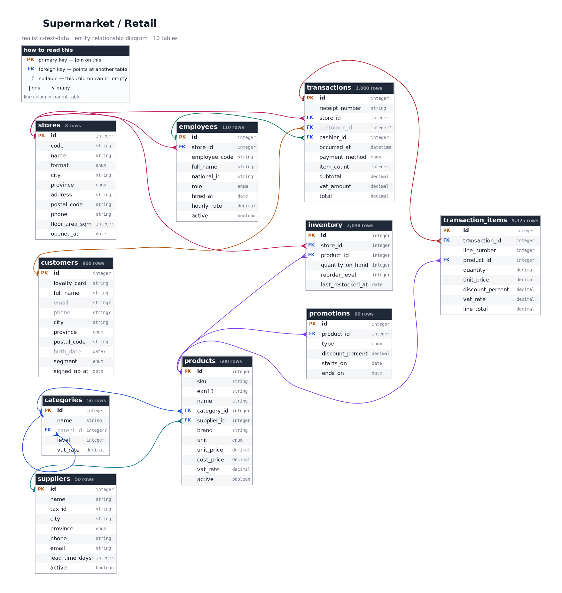
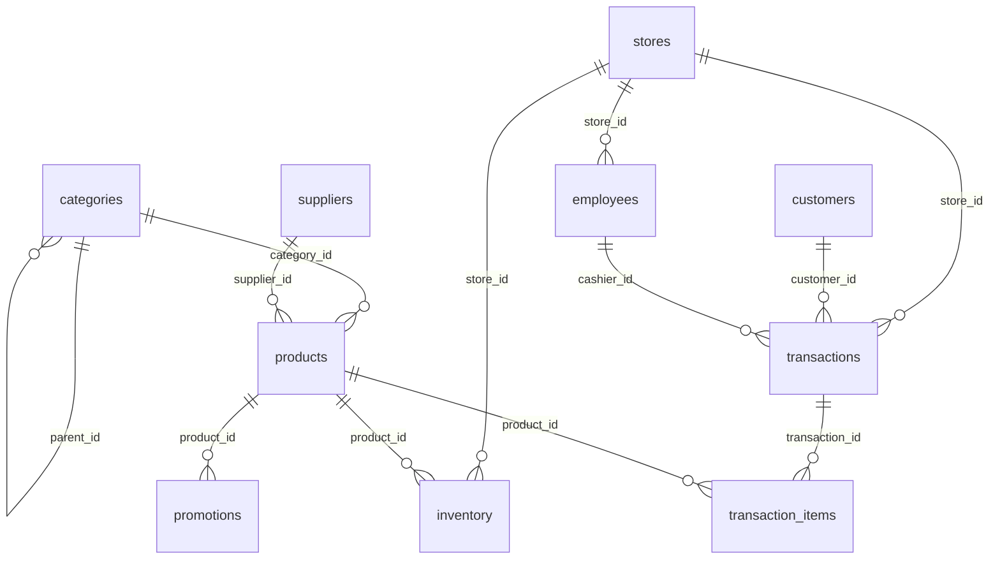

# Supermarket / Retail

> ⚠️ **SYNTHETIC DATA.** Every record in this repository is invented. No real people, patients, accounts, vehicles or students appear here. See [synthetic-data-guarantees.md](../synthetic-data-guarantees.md).

## What is this?

A Spanish supermarket chain: a handful of stores, a full grocery catalogue organised into a category tree, loyalty-card customers, and two and a half years of till transactions.

This is the most conventional business-shaped data in the repository, which is what makes it the best starting point for testing an application: a catalogue, a customer list, and a large transactions table joining them.

The money reconciles. For every basket, the line totals sum exactly to the recorded total and the VAT breakdown adds up, using the three real Spanish VAT bands -- 4% on staples, 10% on most food, 21% on everything else. Barcodes carry valid check digits and will scan.

## Tables at a glance

| Table | Rows | One row is... |
|---|---:|---|
| [`stores`](#stores) | 8 | physical store in the chain. |
| [`categories`](#categories) | 56 | product category, at any level of the hierarchy. |
| [`suppliers`](#suppliers) | 50 | company that supplies products to the chain. |
| [`employees`](#employees) | 110 | member of store staff. |
| [`products`](#products) | 600 | distinct product line carried by the chain. |
| [`inventory`](#inventory) | 2,098 | product held at one store. |
| [`customers`](#customers) | 900 | loyalty-card holder. |
| [`promotions`](#promotions) | 90 | promotional offer on one product. |
| [`transactions`](#transactions) | 3,000 | completed till transaction. |
| [`transaction_items`](#transaction_items) | 9,325 | product scanned at the till within one transaction. |

## How the tables relate

Arrows point from the table that *owns* a row to the tables that *reference* it. Every foreign key in this diagram resolves -- there are no orphan rows anywhere in this topic.

*Full-size: [`png/supermarket/erd.png`](../../png/supermarket/erd.png) &middot; source: [`erd.dot`](../../png/supermarket/erd.dot). Both are generated from the schema, so they cannot go stale.*

Same diagram as Mermaid (renders inline on GitHub, without the columns)

## Where to get it

| Format | Path | Pinned download |
|---|---|---|
| `csv` | [`csv/supermarket/`](../../csv/supermarket/) | [`stores.csv`](https://cdn.jsdelivr.net/gh/jasocami/realistic-test-data@v0.1.0/csv/supermarket/stores.csv) |
| `json` | [`json/supermarket/`](../../json/supermarket/) | [`stores.json`](https://cdn.jsdelivr.net/gh/jasocami/realistic-test-data@v0.1.0/json/supermarket/stores.json) |
| `db` | [`db/supermarket/`](../../db/supermarket/) | [`supermarket.sqlite`](https://cdn.jsdelivr.net/gh/jasocami/realistic-test-data@v0.1.0/db/supermarket/supermarket.sqlite) |
| `png` | [`png/supermarket/`](../../png/supermarket/) | [`stores.png`](https://cdn.jsdelivr.net/gh/jasocami/realistic-test-data@v0.1.0/png/supermarket/stores.png) |

See [linking-files.md](../linking-files.md) for how to use these links from Python, JavaScript, SQL or the command line.

## Column dictionary

Every column, what it means, and whether it can be empty.

### `stores`

**8 rows.** One row per physical store in the chain.

The shops themselves. Everything operational hangs off a store: staff work at one, stock is counted per store, and every till transaction happens at one.

| Column | Type | Null | Description |
|---|---|:---:|---|
| `id` | `integer` **PK** |  | Surrogate primary key, sequential from 1. This is what every other table joins against. Example: `1` |
| `code` | `string` unique |  | Internal store code as it appears on receipts and delivery notes. Humans quote this rather than the numeric id. Example: `STO-0001` Matches `^STO-\d{4}$` |
| `name` | `string` unique |  | Trading name, combining the store format with a brand and the city it serves. Invented -- no real retail chain is named here. Example: `Supermercado Vega Real Sevilla` |
| `format` | `enum` |  | Store size band. Hipermercados carry the full range and the most staff; Express shops are small city-centre outlets with a reduced assortment. Example: `Supermercado` One of: `Express`, `Hipermercado`, `Supermercado` |
| `city` | `string` |  | Spanish city the store is located in, drawn from real municipalities weighted by population. Example: `Sevilla` |
| `province` | `enum` |  | Province the city belongs to. Always agrees with the first two digits of the postal code, since both derive from the same choice of city. Example: `Sevilla` One of: `A Coruña`, `Albacete`, `Alicante`, `Almería`, `Asturias`, `Badajoz`, `Baleares`, `Barcelona`, `Bizkaia`, `Burgos`, `Cantabria`, `Castellón`, `Ceuta`, `Ciudad Real`, `Cuenca`, `Cáceres`, `Cádiz`, `Córdoba`, `Gipuzkoa`, `Girona`, `Granada`, `Guadalajara`, `Huelva`, `Huesca`, `Jaén`, `La Rioja`, `Las Palmas`, `León`, `Lleida`, `Lugo`, `Madrid`, `Melilla`, `Murcia`, `Málaga`, `Navarra`, `Ourense`, `Palencia`, `Pontevedra`, `Salamanca`, `Santa Cruz de Tenerife`, `Segovia`, `Sevilla`, `Soria`, `Tarragona`, `Teruel`, `Toledo`, `Valencia`, `Valladolid`, `Zamora`, `Zaragoza`, `Álava`, `Ávila` |
| `address` | `string` |  | Street address in Spanish format, with the number following the street name. Invented. Example: `Avenida de Andalucía, 118` |
| `postal_code` | `string` |  | Spanish postal code whose leading pair is the province code, so it always matches the province column beside it. Example: `41009` Matches `^\d{5}$` |
| `phone` | `string` |  | Store telephone. The dialling prefix matches the province, exactly as a real Spanish landline does. Example: `+34 954 21 08 33` |
| `floor_area_sqm` | `integer` _m²_ |  | Sales floor area in square metres, correlated with the store format -- Express shops run about 300 m², Hipermercados several thousand. Example: `1450` |
| `opened_at` | `date` |  | Date the store first opened for trade, spread across the twenty years before the dataset period. Example: `2014-03-17` |

**Notes**

- Floor area tracks `format`, so grouping by format and averaging the area produces a sensible chart rather than noise.

### `categories`

**56 rows.** One row per product category, at any level of the hierarchy.

A two-level product taxonomy stored as a self-referencing tree. Top level rows are the aisles ('Frescos', 'Bebidas') and have no parent; the rest are the shelves within them and point back at their aisle. This is the table to use when testing recursive queries, breadcrumb rendering or tree-shaped UI components.

| Column | Type | Null | Description |
|---|---|:---:|---|
| `id` | `integer` **PK** |  | Surrogate primary key, sequential from 1. Parents always have a lower id than their children, so a simple ordered insert works. Example: `1` |
| `name` | `string` |  | Category name in Spanish, as it would appear on the aisle sign. Names are unique within a parent but not globally, which is realistic and worth testing. Example: `Frutas y verduras` |
| `parent_id` | `integer` → `categories.id` | ✓ | The aisle this shelf belongs to, or empty for the nine top-level aisles. This is the self-reference that makes the table a tree. Example: `1` |
| `level` | `integer` |  | Depth in the tree: 1 for an aisle, 2 for a shelf within it. Stored so you can filter to one level without walking the hierarchy. Example: `2` |
| `vat_rate` | `decimal` _fraction_ |  | The Spanish VAT band products in this category attract: 0.04 superreducido for staples, 0.10 reducido for most food, 0.21 general for non-food. Inherited from the parent aisle. Example: `0.04` |

**Notes**

- Spain charges three different VAT rates on supermarket goods. Bread, milk, eggs, fruit and vegetables sit in the 4% band; most other food is 10%; cleaning products, alcohol and household goods are 21%. Tax calculations over this data therefore produce believable totals.

### `suppliers`

**50 rows.** One row per company that supplies products to the chain.

Wholesalers and producers. Every product is bought from exactly one supplier, so this is the table to join through when answering questions about sourcing or lead times.

| Column | Type | Null | Description |
|---|---|:---:|---|
| `id` | `integer` **PK** |  | Surrogate primary key, sequential from 1. Example: `1` |
| `name` | `string` unique |  | Company name in Spanish commercial form, ending in S.L. or S.A. -- the Spanish equivalents of Ltd and PLC. All invented. Example: `Campo Sur Distribuciones S.L.` |
| `tax_id` | `string` unique |  | Spanish CIF, the company tax identifier. The leading letter encodes the company type -- B for S.L., A for S.A. Invented and not registered to anybody. Example: `B12345678` Matches `^[A-Z]\d{8}$` |
| `city` | `string` |  | Spanish city the supplier operates from, which is often where the produce itself originates. Example: `Valencia` |
| `province` | `enum` |  | Province of the supplier's registered address, consistent with its postal code. Example: `Valencia` One of: `A Coruña`, `Albacete`, `Alicante`, `Almería`, `Asturias`, `Badajoz`, `Baleares`, `Barcelona`, `Bizkaia`, `Burgos`, `Cantabria`, `Castellón`, `Ceuta`, `Ciudad Real`, `Cuenca`, `Cáceres`, `Cádiz`, `Córdoba`, `Gipuzkoa`, `Girona`, `Granada`, `Guadalajara`, `Huelva`, `Huesca`, `Jaén`, `La Rioja`, `Las Palmas`, `León`, `Lleida`, `Lugo`, `Madrid`, `Melilla`, `Murcia`, `Málaga`, `Navarra`, `Ourense`, `Palencia`, `Pontevedra`, `Salamanca`, `Santa Cruz de Tenerife`, `Segovia`, `Sevilla`, `Soria`, `Tarragona`, `Teruel`, `Toledo`, `Valencia`, `Valladolid`, `Zamora`, `Zaragoza`, `Álava`, `Ávila` |
| `phone` | `string` |  | Commercial contact number, with a dialling prefix matching the supplier's own province. Example: `+34 963 55 12 04` |
| `email` | `string` |  | Orders inbox on the reserved example.com domain, so nothing sent here could reach a real business. Example: `pedidos@campo-sur.example.com` |
| `lead_time_days` | `integer` _days_ |  | Working days between placing an order and receiving it, from 1 for local fresh produce to 21 for imported goods. Example: `3` |
| `active` | `boolean` |  | Whether the chain still buys from this supplier. About 8% are dormant, which gives you rows that should be filtered out of an ordering screen. Example: `true` |

### `employees`

**110 rows.** One row per member of store staff.

Shop-floor and management staff, each assigned to one store. Cashiers appear as the operator on till transactions, which is what links this table into the sales data.

| Column | Type | Null | Description |
|---|---|:---:|---|
| `id` | `integer` **PK** |  | Surrogate primary key, sequential from 1. Example: `1` |
| `store_id` | `integer` → `stores.id` |  | The store this person works at. Everybody is assigned to exactly one store in this dataset. Example: `1` |
| `employee_code` | `string` unique |  | Payroll reference, the number that appears on a rota and on the bottom of a till receipt. Example: `EMP-00042` Matches `^EMP-\d{5}$` |
| `full_name` | `string` |  | Spanish name with two surnames -- the father's followed by the mother's -- which is worth testing any name-splitting code against. Example: `Javier Moreno Ortega` |
| `national_id` | `string` unique |  | Spanish DNI, eight digits plus a check letter computed modulo 23. Structurally valid, so it passes a real DNI validator. Example: `12345678Z` Matches `^\d{8}[A-Z]$` |
| `role` | `enum` |  | Job title. Cashiers dominate, as they do in a real shop, and only they appear as transaction operators. Example: `Cashier` One of: `Baker`, `Butcher`, `Cashier`, `Department manager`, `Fishmonger`, `Security`, `Shelf stacker`, `Store manager` |
| `hired_at` | `date` |  | Start date, always on or after the store's own opening date -- nobody was hired into a shop that did not exist. Example: `2021-09-06` |
| `hourly_rate` | `decimal` _EUR_ |  | Gross pay per hour in euros, from around the Spanish minimum wage for shop-floor roles up to about 25 for a store manager. Example: `11.4` |
| `active` | `boolean` |  | Whether the person still works here. Around 12% have left, which is a realistic retail turnover rate and gives you inactive rows to exclude. Example: `true` |

### `products`

**600 rows.** One row per distinct product line carried by the chain.

The catalogue. Every product has a scannable EAN-13 barcode, a category, a supplier and a shelf price. This is the anchor table for anything to do with what the shop sells.

| Column | Type | Null | Description |
|---|---|:---:|---|
| `id` | `integer` **PK** |  | Surrogate primary key, sequential from 1. Use this for joins rather than the SKU or the barcode. Example: `1` |
| `sku` | `string` unique |  | Internal stock-keeping unit. The chain's own reference, used on shelf labels and in ordering. Example: `SKU-001337` Matches `^SKU-\d{6}$` |
| `ean13` | `string` unique |  | The printed barcode, thirteen digits with a correct check digit -- so a barcode library will actually decode it instead of rejecting it. The leading 84 is the GS1 country prefix for Spain. Example: `8412345678905` Matches `^\d{13}$` |
| `name` | `string` |  | Shelf name in Spanish: what the product is, the brand, and the pack size, exactly as a price label would read. Example: `Aceite de oliva virgen extra Campo Sur 1L` |
| `category_id` | `integer` → `categories.id` |  | The shelf this product sits on. Always a level-2 category, never a top-level aisle. Example: `12` |
| `supplier_id` | `integer` → `suppliers.id` |  | Who the chain buys this product from. One supplier per product line. Example: `7` |
| `brand` | `string` |  | Own-brand or supplier brand name. All sixteen are invented and none corresponds to a real grocery brand. Example: `Campo Sur` |
| `unit` | `enum` |  | How the product is sold: by the item (ud), by weight (kg), by volume (L) or as a multipack. This determines whether a quantity can be fractional. Example: `L` One of: `ud`, `kg`, `L`, `pack` |
| `unit_price` | `decimal` _EUR_ |  | Shelf price including VAT, in euros. Prices end in .99, .95 or .49 far more often than chance, because retailers really do price that way. Example: `7.99` |
| `cost_price` | `decimal` _EUR_ |  | What the chain pays the supplier per unit. Always below unit_price, giving a gross margin between about 12% and 45% depending on category. Example: `5.6` |
| `vat_rate` | `decimal` _fraction_ |  | Spanish VAT band applied at the till, inherited from the product's category. One of 0.04, 0.10 or 0.21. Example: `0.1` |
| `active` | `boolean` |  | Whether the line is still listed. Roughly 7% are discontinued but retained for historical sales, which is exactly why old transactions can still reference them. Example: `true` |

**Notes**

- A product's `vat_rate` always equals its category's `vat_rate`. Storing it on both is deliberate denormalisation -- it is what a real till system does so that a historical receipt keeps the rate that applied on the day -- and it gives you a consistency rule to verify.
- Discontinued products still appear in older transactions. Filtering products to `active = true` and joining to sales will therefore lose rows, which is a mistake worth being able to reproduce.

### `inventory`

**2,098 rows.** One row per product held at one store.

Current stock levels, one row per store-and-product combination. Not every store carries every product -- Express shops carry a fraction of the range -- so this table is much smaller than stores multiplied by products.

| Column | Type | Null | Description |
|---|---|:---:|---|
| `id` | `integer` **PK** |  | Surrogate primary key, sequential from 1. Example: `1` |
| `store_id` | `integer` → `stores.id` |  | Which store holds this stock. Stock is counted per store, never centrally, so the same product appears once for every shop that lists it. Example: `1` |
| `product_id` | `integer` → `products.id` |  | Which product is being counted. Only active product lines are stocked, so discontinued items have no inventory row anywhere. Example: `42` |
| `quantity_on_hand` | `integer` _units_ |  | Units currently on the shelf and in the back room. Can be zero, and about 4% of rows are -- an out-of-stock line you should be able to surface. Example: `48` |
| `reorder_level` | `integer` _units_ |  | The threshold at which the system should raise a replenishment order. Comparing this with quantity_on_hand gives you a ready-made 'needs reordering' query. Example: `20` |
| `last_restocked_at` | `date` |  | Date of the most recent delivery for this line at this store. Fast-moving fresh goods are restocked far more recently than bazar items. Example: `2025-06-12` |

### `customers`

**900 rows.** One row per loyalty-card holder.

Registered customers. Only loyalty-card holders appear here, so many transactions have no customer at all -- which is realistic and makes this a natural LEFT JOIN test case.

| Column | Type | Null | Description |
|---|---|:---:|---|
| `id` | `integer` **PK** |  | Surrogate primary key, sequential from 1. Example: `1` |
| `loyalty_card` | `string` unique |  | The number printed on the physical loyalty card, which is what a cashier scans at the till. Example: `LC-000004217` Matches `^LC-\d{9}$` |
| `full_name` | `string` |  | Spanish name with both surnames, as it would be captured on a loyalty application form. Example: `Carmen Ibáñez Soler` |
| `email` | `string` | ✓ | Contact address on the reserved example.com domain, with accents transliterated away. Empty for about 15% of customers who never supplied one. Example: `carmen.ibanez@example.com` |
| `phone` | `string` | ✓ | Mostly Spanish mobile numbers, since that is what people give a shop. Empty for around 9% of rows. Example: `+34 622 41 07 93` |
| `city` | `string` |  | Spanish city of residence, which is usually but not always the city of the store they shop at. Example: `Sevilla` |
| `province` | `enum` |  | Province of residence, consistent with the postal code in the next column. Example: `Sevilla` One of: `A Coruña`, `Albacete`, `Alicante`, `Almería`, `Asturias`, `Badajoz`, `Baleares`, `Barcelona`, `Bizkaia`, `Burgos`, `Cantabria`, `Castellón`, `Ceuta`, `Ciudad Real`, `Cuenca`, `Cáceres`, `Cádiz`, `Córdoba`, `Gipuzkoa`, `Girona`, `Granada`, `Guadalajara`, `Huelva`, `Huesca`, `Jaén`, `La Rioja`, `Las Palmas`, `León`, `Lleida`, `Lugo`, `Madrid`, `Melilla`, `Murcia`, `Málaga`, `Navarra`, `Ourense`, `Palencia`, `Pontevedra`, `Salamanca`, `Santa Cruz de Tenerife`, `Segovia`, `Sevilla`, `Soria`, `Tarragona`, `Teruel`, `Toledo`, `Valencia`, `Valladolid`, `Zamora`, `Zaragoza`, `Álava`, `Ávila` |
| `postal_code` | `string` |  | Spanish postal code whose first two digits are the province code, so address validation passes. Example: `41009` Matches `^\d{5}$` |
| `birth_date` | `date` | ✓ | Date of birth where the customer gave one, used for age-band marketing. Empty for about 20% of rows. Example: `1986-04-22` |
| `segment` | `enum` |  | Marketing segment derived from spend and visit frequency. Premium customers really do spend more per basket in this data, so the segmentation is worth plotting. Example: `regular` One of: `new`, `occasional`, `premium`, `regular` |
| `signed_up_at` | `date` |  | Date the loyalty card was issued. Always on or before that customer's first transaction. Example: `2023-04-18` |

### `promotions`

**90 rows.** One row per promotional offer on one product.

Time-limited offers. A promotion covers a single product over a date range, so checking whether a given sale was discounted means comparing the transaction date against this table.

| Column | Type | Null | Description |
|---|---|:---:|---|
| `id` | `integer` **PK** |  | Surrogate primary key, sequential from 1. Example: `1` |
| `product_id` | `integer` → `products.id` |  | The product on offer. A product can have several promotions over time, but they never overlap. Example: `42` |
| `type` | `enum` |  | Mechanic of the offer: a straight percentage off, second unit at half price, three for the price of two, or a fixed cash reduction. Example: `percentage` One of: `fixed_discount`, `percentage`, `second_unit_half_price`, `three_for_two` |
| `discount_percent` | `decimal` _percent_ |  | Headline reduction as a percentage, between 5 and 50. For non-percentage mechanics this records the effective equivalent saving. Example: `25.0` |
| `starts_on` | `date` |  | First day the offer is live, inclusive. Compare a sale date against this and ends_on to decide whether a line was discounted. Example: `2025-03-01` |
| `ends_on` | `date` |  | Last day the offer is live, inclusive. Always after starts_on, typically by one to six weeks. Example: `2025-03-31` |

### `transactions`

**3,000 rows.** One row per completed till transaction.

The basket header: who bought, where, when, how they paid and what it came to. The individual products are in transaction_items, and the totals here are guaranteed to equal the sum of those lines.

| Column | Type | Null | Description |
|---|---|:---:|---|
| `id` | `integer` **PK** |  | Surrogate primary key, sequential from 1 and ordered by time, so a higher id is always a later sale. Example: `1` |
| `receipt_number` | `string` unique |  | The number printed on the receipt: store code, then a sequence. This is what a customer quotes when returning something. Example: `0001-00004217` Matches `^\d{4}-\d{8}$` |
| `store_id` | `integer` → `stores.id` |  | Which shop rang up the sale. Always a store that had already opened on the transaction date, and the store the cashier works at. Example: `1` |
| `customer_id` | `integer` → `customers.id` | ✓ | The loyalty-card holder, or empty for an anonymous sale. About 45% of transactions have no customer, which is realistic and makes this the table's main LEFT JOIN case. Example: `42` |
| `cashier_id` | `integer` → `employees.id` |  | The employee who operated the till. Always someone whose role is Cashier and who works at this store. Example: `7` |
| `occurred_at` | `datetime` |  | Date and time of the sale. Trading hours are 09:00 to 21:30, with the familiar lunchtime and early evening peaks and a much busier Saturday. Example: `2025-03-14T18:42:00` |
| `payment_method` | `enum` |  | How the basket was paid for. Card dominates, as it now does in Spain, with cash still meaningful and mobile payment growing. Example: `card` One of: `card`, `cash`, `mobile`, `voucher` |
| `item_count` | `integer` _lines_ |  | Number of distinct product lines in the basket, matching the row count in transaction_items. Most baskets are small; a weekly shop is much larger. Example: `7` |
| `subtotal` | `decimal` _EUR_ |  | Total before VAT, in euros. Equals the sum of the line totals minus the VAT those lines carry. Example: `41.32` |
| `vat_amount` | `decimal` _EUR_ |  | Total VAT across the basket. Because products attract different rates, this is not a fixed percentage of the subtotal -- which is precisely what makes it worth testing against. Example: `4.94` |
| `total` | `decimal` _EUR_ |  | What the customer actually paid. Always exactly equal to the sum of the line totals in transaction_items, verified to the cent in CI. Example: `46.26` |

**Notes**

- The money invariant: for every transaction, the sum of its line totals equals `total`, and `subtotal` plus `vat_amount` equals `total`. Both are asserted in the test suite. Totals that do not reconcile are the single most common flaw in generated retail data.
- Transaction volume rises on Fridays and Saturdays and dips on Mondays. Plot sales by weekday and you get the shape of a real trading week.

### `transaction_items`

**9,325 rows.** One row per product scanned at the till within one transaction.

The basket lines -- by far the largest table in this topic and the one to use when you need volume. Each row is one product, its quantity, and what it came to after any discount.

| Column | Type | Null | Description |
|---|---|:---:|---|
| `id` | `integer` **PK** |  | Surrogate primary key, sequential from 1. Example: `1` |
| `transaction_id` | `integer` → `transactions.id` |  | The basket this line belongs to. Grouping by this column reconstructs the receipt. Example: `1` |
| `line_number` | `integer` |  | Position of this line on the printed receipt, starting at 1 within each transaction. Example: `1` |
| `product_id` | `integer` → `products.id` |  | What was scanned. The same product can appear only once per transaction, as a till would merge duplicates into one line. Example: `42` |
| `quantity` | `decimal` _units_ |  | How many were bought. Whole numbers for items sold by the unit, and fractional for anything priced by the kilo -- 0.84 kg of tomatoes is a real line. Example: `2.0` |
| `unit_price` | `decimal` _EUR_ |  | Price per unit at the moment of sale, copied from the product. Stored rather than looked up, because a receipt must keep the price that was charged even after the shelf price changes. Example: `7.99` |
| `discount_percent` | `decimal` _percent_ |  | Reduction applied to this line, from an active promotion. Zero on about 88% of lines. Example: `0.0` |
| `vat_rate` | `decimal` _fraction_ |  | VAT band for this line, copied from the product at the time of sale for the same historical-accuracy reason as unit_price. Example: `0.1` |
| `line_total` | `decimal` _EUR_ |  | Quantity times unit price, less the discount, rounded to the cent. Summing this column within a transaction gives exactly that transaction's total. Example: `15.98` |

---

*This page is generated from the schema definitions in `generators/topics/supermarket.py`. Do not edit it by hand -- your changes would be overwritten on the next build. Edit the `description=` on the relevant `Field` instead, and run `python build.py`.*
